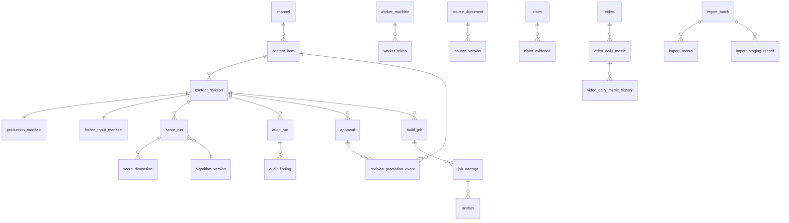

# DATA_MODEL_PLAN.md

> Đề xuất entity/relationship cho **Neon PostgreSQL**. **Không tạo migration thật ở giai đoạn này.**
> Backend-first: mọi entity phải dùng được mà không cần frontend.

---

## 0.0 Phạm vi theo phase — **bảng này là nguồn chuẩn**

| Phase | Entity |
|---|---|
| **P1 Backend foundation** | `user`, `session`, `api_token`, `role`, `user_channel_role`, `audit_event`, `idempotency_record`, `channel` |
| **P2 Content core** | `content_item`, `content_revision`, `revision_promotion_event`, `score_run_counter`, `source_document`, `source_version`, `claim`, `claim_evidence`, `content_item_source`, `audit_run`, `audit_finding`, `score_run`, `score_dimension`, `algorithm`, `algorithm_version`, `approval`, `production_manifest`, `frozen_input_manifest` |
| **P3 Legacy import** | `import_batch`, `import_staging_record`, `import_record`, `legacy_id_map` |
| **P4 CLI protocol** | `worker_machine`, `worker_token`, `worker_enrollment_code`, `build_job`, `job_attempt`, `job_event`, `job_lease_history`, `artifact` |
| **P5 E2E MVP** | *(không entity mới — ghép các phần trên)* |
| **P6 Analytics** | `video`, `video_daily_metric(+_history)`, `channel_daily_metric(+_history)`, `video_traffic_source_daily`, `analytics_sync_run`, `analytics_sync_partition`, `publish_record` |
| **P7 Recommendation** | `recommendation_run`, `recommendation_item` |
| **Sau (P1b)** | `series`, `content_pillar`, `campaign`, `calendar_entry`, `tag`, `content_item_tag`, `cc_package_mirror`, `template`, `voice_profile`, `revision_section` |

---

## 0. Quy ước chung

| Chủ đề | Quy ước |
|---|---|
| Engine | **PostgreSQL (Neon)** duy nhất. Không thiết kế cho tính di động sang engine khác. |
| Khoá chính | `id` — UUIDv7 (`uuid`). Không auto-increment (lộ số lượng, khó merge). |
| Thời gian | `timestamptz`, luôn UTC. `created_at`/`updated_at` bắt buộc. |
| Xoá | **Soft delete** (`deleted_at`) cho dữ liệu người dùng. **Hard delete** cho dữ liệu phái sinh tính lại được. Bảng audit/score/approval **không bao giờ xoá**. |
| Enum | `text` + `CHECK` (tránh `ALTER TYPE` khó rollback). |
| Tỉ lệ | Số nguyên basis-point (0–10000) thay vì float — so sánh chính xác. |
| Tenancy | **Không** `tenant_id` ở MVP. Cách ly bằng `channel_id` + `user_channel_role`. Đường nâng cấp §12. |
| Naming | `snake_case`, bảng số ít, FK `<bảng>_id`. |

### Quy tắc chọn cột quan hệ vs JSONB *(theo yêu cầu §2 của brief)*

| Kiểu dữ liệu | Lưu thế nào | Ví dụ |
|---|---|---|
| Cần query/filter/join/aggregate thường xuyên | **Cột quan hệ** | `status`, `channel_id`, `format`, `overall_score`, `published_at` |
| Payload đổi hình dạng thường xuyên | **`jsonb` + `schema_version`** | `visual_prompts`, `semantic_beats`, `thumbnail_concepts` |
| Nội dung dài, đọc nguyên khối | **`text`** | `audio_script`, `outline`, `description` |
| Danh sách cần tìm kiếm | **`text[]`** | `keywords`, `hashtags` |
| File nhị phân lớn | **Không vào DB** — local path + checksum | `.mp4`, `.wav` |

> Mọi cột `jsonb` **bắt buộc** đi kèm `schema_version` để migrate được về sau.

**Căn cứ kích thước thật (đo trên repo):** audio script lớn nhất **67,8 KB**;
SEO/shot-list JSON lớn nhất **194,8 KB**; file text lớn nhất trong Content-Creator **444,9 KB**.
Tất cả đều dư sức nằm trong Postgres và dưới giới hạn body 4,5 MB của Vercel (dư 23–66×).

---

## 1. Identity & auth

### `user`
`id`, `email` UNIQUE, `display_name`, `password_hash` (Argon2id), `is_active`, `must_change_password`, `created_at`, `last_login_at`

### `session`
`id`, `user_id` FK, `token_sha256` UNIQUE, `created_at`, `expires_at`, `revoked_at`, `ip`, `user_agent`
· Xoay `id` sau mỗi lần đăng nhập; đổi mật khẩu ⇒ revoke mọi session khác.

### `api_token` (PAT — CLI hành động **với tư cách user**)
`id`, `user_id` FK, `name`, `token_sha256` UNIQUE, `token_prefix`, `scopes` text[], `expires_at`, `revoked_at`, `last_used_at`
· Khác `worker_token` (§6): PAT mang quyền user; worker token chỉ chạm `/api/worker/*`.
· **Scope `ops`**: dùng cho endpoint vận hành production (`/api/internal/readyz`, `/api/internal/drain-reap`).
  ⚠️ **Cố ý gắn user**, không phải secret dùng chung — nhờ vậy kiểm được vai trò `ADMIN` và
  `audit_event.actor_id` ghi **đúng người** đã chạy. Xoay/thu hồi theo từng người.

### `role` / `user_channel_role`
Vai trò: `ADMIN`, `EDITOR`, `REVIEWER`, `APPROVER`, `READONLY`.
`user_channel_role(user_id, channel_id, role)` PK ba cột.

### `idempotency_record` *(thêm — cần cho B1 và cho mọi POST đổi trạng thái)*
- **Mục đích:** `API_AND_WORKER_PROTOCOL.md §1` hứa `Idempotency-Key` cho **mọi** POST đổi trạng thái,
  nhưng trước đây chỉ `build_job.idempotency_key` có chỗ lưu ⇒ approve/freeze/promote/import/score
  **không thật sự idempotent**.
- **Trường:** `id`, `scope` (`SCORE|AUDIT|APPROVE|FREEZE|PROMOTE|IMPORT|JOB_COMPLETE|…`),
  `idempotency_key`, `principal_kind` (`USER|WORKER`), `principal_id`,
  `request_hash` (hash body đã chuẩn hoá), `response_snapshot` jsonb, `http_status`,
  `entity_type`, `entity_id`, `created_at`, `expires_at`
- **Unique:** `(scope, idempotency_key, principal_id)`
- **Ngữ nghĩa:** cùng key + **cùng** `request_hash` ⇒ trả lại `response_snapshot` (200, không tác dụng
  phụ). Cùng key nhưng **khác** `request_hash` ⇒ **409 `IDEMPOTENCY_KEY_REUSED`** (chống dùng lại key
  cho nội dung khác).
- **Retention:** 30 ngày (`expires_at`), dọn bằng job định kỳ.

### `audit_event` — append-only
`id`, `occurred_at`, `actor_kind` (`USER|WORKER|CRON|SYSTEM`), `actor_id`, `action`, `entity_type`, `entity_id`, `before` jsonb null, `after` jsonb null, `request_id`, `ip`
· Index `(entity_type, entity_id, occurred_at DESC)`, `(actor_id, occurred_at DESC)` · **Không có API xoá/sửa.**

---

## 2. Channel

### `channel`
`id`, `label` UNIQUE (khớp `.youtube_channels/{label}.json`), `youtube_channel_id` UNIQUE, `title`, `domain_id` (`BUD|FS|CL`), `default_voice`, `timezone`, `approval_policy` (`SELF_APPROVAL_ALLOWED|TWO_PERSON_REQUIRED`), `is_active`, timestamps, `deleted_at`
· ⚠️ **Không** chứa `client_secret`/`refresh_token`.

### `channel_credential_ref`
`id`, `channel_id` FK, `worker_machine_id` FK, `credential_path`, `scopes` text[], `status` (`OK|EXPIRED|REVOKED|UNKNOWN`), `last_verified_at`, `last_error_code`
· Unique `(channel_id, worker_machine_id)` · Chỉ *tham chiếu*, không giá trị secret.

---

## 3. Content

### `content_item`
- **Mục đích:** đại diện **mọi** dạng — Long, Short, tập trong series, ý tưởng chưa sản xuất, nội dung đã publish, Short tách từ Long, Long mở rộng từ Short.
- **Trường:**
  `id`, `channel_id` FK, `format` (`LONG|SHORT`), `series_id` FK null, `content_pillar_id` FK null,
  `topic`, `angle`, `objective`, `target_audience`,
  `planned_date` date null, `publish_date` timestamptz null, `priority` int,
  `status` (state machine sản xuất — `TARGET_ARCHITECTURE.md §8.1`),
  `approved_revision_id` FK null, `production_revision_id` FK null,
  `published_video_id` FK null → `video`,
  `parent_content_item_id` FK null, `derivation_kind` (`ORIGINAL|LONG_TO_SHORT|SHORT_TO_LONG|REUSE`) null,
  `origin` (`CONTENT_REPO|HUB_IDEA|SHORT_GENERATOR|IMPORT`),
  `source_package_id` text null (khớp `manifest.package_id`),
  `created_by`, timestamps, `deleted_at`
- **Unique:** `source_package_id WHERE source_package_id IS NOT NULL` (partial)
- **Index:** `(channel_id, status)`, `(channel_id, format)`, `(planned_date)`, `(parent_content_item_id)`
- **Bất biến:** `approved_revision_id` / `production_revision_id` chỉ trỏ revision `FROZEN` **của chính item này** (FK composite `(content_item_id, revision_id)`).

### `content_revision` — bất biến sau freeze
- **Trường:**
  `id`, `content_item_id` FK, `revision_no` int, `parent_revision_id` FK null,
  `status` (`DRAFT|REVIEW_REQUIRED|FROZEN`) — ⚠️ **không có `SUPERSEDED`**, xem ghi chú dưới,

  **Nội dung text — cột riêng (query/diff/score được):**
  `hook`, `outline`, `audio_script`, `description`, `pinned_comment`, `community_post`,
  `research_summary`, `risk_notes`, `production_notes`, `title_final` — kiểu `text`;
  `title_candidates`, `keywords`, `hashtags` — `text[]`

  **Payload linh hoạt:** `seo_package`, `semantic_beats`, `visual_prompts`, `thumbnail_concepts`,
  `chapters` — `jsonb`; kèm `payload_schema_version` int

  **Provenance:** `created_by_kind` (`HUMAN|AGENT`), `created_by_user_id` null, `created_by_worker_id` null,
  `generator_name`, `generator_version`, `algorithm_version_id` FK null,
  `change_reason` text, `triggered_by_audit_run_id` FK null, `triggered_by_score_run_id` FK null,
  `content_sha256` (hash chuẩn hoá toàn bộ nội dung),
  `frozen_at`, `frozen_by`, `created_at`
- **Unique:** `(content_item_id, revision_no)`
- **Index:** `(content_item_id, revision_no DESC)`, `(status)`, `(content_sha256)`
- **Bất biến B-R1:** hàng `FROZEN` **không được UPDATE** (trigger chặn) — tuyệt đối, không ngoại lệ.

> ⚠️ **Sửa theo Codex v2R2 HIGH-3.** Bản trước vừa liệt kê `SUPERSEDED` trong `status`, vừa yêu cầu
> trigger chặn **mọi** UPDATE lên hàng `FROZEN`. Hai điều đó loại trừ nhau: chuyển
> `FROZEN → SUPERSEDED` **không thể** vượt qua trigger; mà nới trigger thì nội dung đã freeze lại
> sửa được ⇒ phá vỡ hash, approval, audit, score và khả năng tái lập.
>
> **Chốt:** `content_revision.status` dừng vĩnh viễn ở `FROZEN`. **Supersession là dữ liệu suy ra**,
> không phải trạng thái ghi đè:
> - "revision nào đang sản xuất" ⇒ đọc `content_item.production_revision_id`
> - "revision nào từng được duyệt" ⇒ đọc `approval.status`
> - lịch sử promote ⇒ bảng **`revision_promotion_event`** (append-only:
>   (xem định nghĩa đầy đủ ngay dưới)

### `revision_promotion_event` — append-only *(thêm theo Codex v2R3 MEDIUM)*
- **Mục đích:** ghi lại **mọi** lần đổi `content_item.production_revision_id`. Đây là nguồn duy nhất
  để suy ra "revision nào từng/đang là production" mà **không** phải sửa hàng `FROZEN`.
- **Trường:** `id`, `content_item_id` FK, `from_revision_id` FK **null** (lần promote đầu tiên),
  `to_revision_id` FK **NOT NULL**, `approval_id` FK NOT NULL, `promoted_by` FK user NOT NULL,
  `promoted_at`, `reason` text
- **Ràng buộc — cả hai revision phải thuộc ĐÚNG content item đó:**
  ```sql
  ALTER TABLE content_revision ADD CONSTRAINT uq_rev_item UNIQUE (content_item_id, id);
  ALTER TABLE revision_promotion_event ADD CONSTRAINT fk_promo_to
    FOREIGN KEY (content_item_id, to_revision_id)   REFERENCES content_revision (content_item_id, id);
  ALTER TABLE revision_promotion_event ADD CONSTRAINT fk_promo_from
    FOREIGN KEY (content_item_id, from_revision_id) REFERENCES content_revision (content_item_id, id);
  ```
- **Index:** `(content_item_id, promoted_at DESC)`
- **CHECK bắt buộc:** `from_revision_id IS DISTINCT FROM to_revision_id` — chặn event `A→A`.
  ⚠️ *Codex v2R7 HIGH-2:* nếu cho phép promote chính revision đang production, transaction sẽ ghi
  event `A→A` **và** supersede đúng cái approval vừa khoá làm đích ⇒ hỏng cả lịch sử lẫn approval.
  API chặn trước bằng **409 `ALREADY_PRODUCTION`**; CHECK là lưới an toàn ở CSDL.
- **Append-only:** trigger chặn UPDATE/DELETE (như `audit_event`)
- **Bắt buộc ghi trong CÙNG transaction** với: cập nhật `content_item.production_revision_id`
  **và** `SUPERSEDED` approval cũ. Thiếu một bước ⇒ **rollback toàn bộ**.
- ⚠️ **Transaction phải TUẦN TỰ HOÁ + CAS theo kỳ vọng của CALLER** (Codex v2R4 HIGH-2, v2R5 HIGH-1):
  `SELECT … FOR UPDATE` trên `content_item`, trên approval của revision **đích**, và trên approval
  `PRODUCTION_READY` của revision **cũ**. Sau đó **đối chiếu giá trị đã khoá với
  `expected_production_revision_id` do caller gửi** (**JSON body**; `If-Match` không dùng cho endpoint này), rồi mới CAS.
  ⚠️ Đọc `:prev` **bên trong** khoá rồi CAS với chính nó là **vô dụng**: kẻ đến sau chờ xong sẽ đọc
  kết quả của kẻ thắng làm kỳ vọng của mình ⇒ CAS cũng thành công ⇒ `A→B→C`, không phải "đúng một thắng".
  `from_revision_id` = giá trị **đã khoá và đã đối chiếu**.
  Giao thức SQL đầy đủ: `API_CONTRACT_PLAN.md` — *Validation promote*.
- ⚠️ **Chỉ supersede approval `PRODUCTION_READY` của revision cũ** (Codex v2R5 HIGH-2).
  **Không** đụng approval ở `RESEARCH_READY` / `CONTENT_READY` / `PUBLISH_READY`. Promote là con
  đường **duy nhất** tới `SUPERSEDED`, nên supersede nhầm là **mất vĩnh viễn**.
- ⚠️ **Revoke không được làm kẹt item** (Codex v2R6 HIGH-2). Approval cũ được xác định từ
  `revision_promotion_event` gần nhất trỏ tới con trỏ hiện tại, và **khoá bất kể `status`**.
  Bước supersede chỉ đổi khi nó còn `ACTIVE`; nếu đã `REVOKED` thì **bỏ qua, không rollback** —
  nếu không, một lần revoke hợp lệ sẽ khiến item **không bao giờ** promote được nữa."),

- **FK buộc `approval_id` đúng item + đúng revision:**
  ```sql
  ALTER TABLE approval ADD CONSTRAINT uq_appr_item_rev UNIQUE (id, content_item_id, content_revision_id);
  ALTER TABLE revision_promotion_event ADD CONSTRAINT fk_promo_appr
    FOREIGN KEY (approval_id, content_item_id, to_revision_id)
    REFERENCES approval (id, content_item_id, content_revision_id);
  ```)
>
> Nhờ vậy hàng `FROZEN` **không bao giờ** bị UPDATE, và vẫn trả lời được mọi câu hỏi về vòng đời.
- **Diff:** tính lúc đọc từ hai revision — **không lưu diff**.
- **Delete:** không bao giờ.

> **Vì sao vừa cột text vừa jsonb:** `audio_script`/`outline`/`description` là thứ reviewer đọc,
> agent sửa, engine chấm điểm và diff ⇒ phải là cột thật. `visual_prompts`/`semantic_beats`
> đổi hình dạng theo domain/template ⇒ jsonb có version.

### `frozen_input_manifest`
`id`, `content_revision_id` FK UNIQUE, `repo_url`, `commit_sha`, `branch`,
`files` jsonb `[{path, blob_sha, content_sha256, bytes}]`,
`environment` jsonb (`hub_commit_sha`, `worker_commit_sha`, `handler_version`, `lockfile_sha256`,
`engine_mode`, `model_repo`, `model_revision`, `voices_asset_sha256`, `voice_name`,
`render_config`, `os_arch`, `ffmpeg_version`, `backend_device`, `seed` nullable), `created_at`
· ⚠️ Clone Content-Creator là **shallow** + `reset --hard` (`content_repo.py:80-90`) ⇒ chỉ ghi
`commit_sha` là **không đủ**. Nội dung thật đã nằm trong `content_revision`, nên rebuild không phụ thuộc git.
· ⚠️ **Không hứa output byte-identical:** `render_engine.py:195-207` sampling có `temperature`,
retry tăng nhiệt, **không seed**. Tiêu chí là *dựng lại đúng input + cấu hình*, output đạt ngưỡng tương đương.

### `production_manifest`
`id`, `content_revision_id` FK UNIQUE, `manifest_sha256`, `payload` jsonb, `created_at` · Bất biến.

---

## 4. Source, claim, evidence

### `source_document`
`id`, `domain_id`, `origin_url` null, `origin_kind` (`WEB|RSS|YOUTUBE|PDF|LOCAL_FILE|API|TRANSCRIPT|MANUAL|AGENT`), `title`, `author`, `publisher`, `published_at` null, `retrieved_at`, `language`, `tier` int (1–6), `is_primary` bool, `license_note`, `status` (`DISCOVERED|APPROVED|REJECTED|RESTRICTED`), `rejected_reason`, `canonical_url_hash`, timestamps
· Unique `(domain_id, canonical_url_hash) WHERE canonical_url_hash IS NOT NULL` · Index `(domain_id, tier)`, `(status)`
· ⚠️ **Fetch chạy ở CLI, không ở Vercel** — giữ SSRF ra khỏi control plane.
· ⚠️ **NGOẠI LỆ DUY NHẤT của quy tắc scope theo kênh.** Mọi bảng nghiệp vụ khác đều dẫn về
  `channel_id` để lọc quyền (§12); `source_document` gắn `domain_id` (`BUD|FS|CL`) vì nguồn dùng
  chung cho nhiều kênh cùng domain. **Hệ quả bắt buộc:**
  1. Phân quyền source suy ra qua `domain_id` → tập kênh mà user có quyền
     (`user_channel_role ⋈ channel.domain_id`). Không có quyền kênh nào thuộc domain ⇒ **404**.
  2. Endpoint list/search source **phải** lọc theo tập domain đó, không trả toàn bộ.
  3. Test cross-channel **phải** phủ riêng nhánh source, vì nó không đi qua đường `channel_id` chung.

### `source_version`
`id`, `source_document_id` FK, `fetched_at`, `content_sha256`, `extracted_text` text null, `storage_backend` (`DB|LOCAL|BLOB`), `local_path` null, `blob_url` null, `byte_size`, `http_status`
· Unique `(source_document_id, content_sha256)` → dedupe tự nhiên

### `claim` / `claim_evidence`
- `claim`: `id`, `domain_id`, `text`, `normalized_sha256`, `confidence_tier` (`HIGH|MEDIUM_HIGH|MEDIUM|LOW`), `status` (`PROPOSED|VERIFIED|DISPUTED|REJECTED`), `risk_level` · Unique `(domain_id, normalized_sha256)`
- `claim_evidence`: `id`, `claim_id` FK, `source_version_id` FK, `stance` (`SUPPORTS|CONTRADICTS|CONTEXT`), `quote`, `locator`, `added_by_kind` · Unique `(claim_id, source_version_id, stance)`
- **Conflict detection:** claim có cả `SUPPORTS` lẫn `CONTRADICTS` chưa giải quyết ⇒ chặn gate Research Ready.

### `content_item_source` / `content_revision_claim`
`(content_item_id, source_document_id, usage_note)` · `(content_revision_id, claim_id, role)`

---

## 5. Audit & scoring **có version** *(yêu cầu §5 của brief)*

### `algorithm` / `algorithm_version`
- `algorithm`: `id`, `key` UNIQUE (vd `HOOK_QUALITY_RULE`), `name`, `kind` (`RULE|LLM|HYBRID`), `description`
- `algorithm_version`: `id`, `algorithm_id` FK, `version` (semver),
  **`dimensions` text[] NOT NULL** (tập dimension version này **thật sự công bố**; phải là tập con của
  danh mục 17 dimension chuẩn), **`weights` jsonb NOT NULL**, **`min_coverage_bp` int NOT NULL**,
  **`comparability_group` text NOT NULL**, **`determinism`** (`DETERMINISTIC|SAMPLED`),
  **`weights_provenance`** (`EXPERT_JUDGMENT|FITTED_FROM_ANALYTICS|INHERITED`), **`superseded_by_version_id` FK null**,
  `ruleset` jsonb null, `prompt_template` text null, `prompt_sha256` null, `released_at`, `is_active`
  · **CHECK khi phát hành:** `keys(weights) == set(dimensions)` và `Σ weights = 10000` — kiểm
    **trong transaction** lúc publish; `dimensions` ⊆ danh mục chuẩn; `dimensions` không trùng lặp.
  · ⚠️ Các trường này **không còn là "đề xuất"**: `BACKEND_MVP_SPEC` suy số dòng `score_dimension`
    **từ `dimensions`**, và validate mọi dimension gửi lên theo nó ⇒ phải là schema chính thức.
  · Unique `(algorithm_id, version)`
  · **Bất biến:** đã phát hành thì không sửa — đổi = version mới. Nhờ vậy giải thích được điểm cũ.

### `score_run` — **append-only**
- **Trường:** `id`, `content_item_id` FK, `content_revision_id` FK **NOT NULL**,
  `algorithm_id` FK, `algorithm_version_id` FK,
  `input_snapshot_hash`, **`run_sequence` int NOT NULL**, **`evaluation_nonce` uuid**,
  `overall_score` int (bp) **nullable**, **`coverage_bp` int**, **`missing_dimensions` jsonb**,
  `explanation` text, `findings` jsonb, `recommendations` jsonb,
  `previous_score_run_id` FK null, `supersedes_score_run_id` FK null, `overall_delta_bp` int null,
  **`input_truncated_at` int null**, `random_seed` null,
  `actor_kind` (`WORKER|USER|SYSTEM`), `worker_machine_id` FK null, `job_attempt_id` FK null, `created_at`
- **Unique:** `(content_revision_id, algorithm_version_id, input_snapshot_hash, run_sequence)`

> ⚠️ **Sửa theo Codex v2R1 BLOCKER-1.** Bản trước dùng unique `(revision, algo_version, input_hash)`
> **không có** `run_sequence`, và gọi đó là "chấm lại y hệt là idempotent". Điều đó **tự mâu thuẫn**:
> nếu khoá chặn dòng thứ hai thì **không thể** giữ nhiều quan sát của cùng một nội dung — trong khi
> chấm bằng LLM vốn **không tất định**, và người dùng có quyền chấm lại có chủ đích.
>
> **Tách hai khái niệm bị gộp nhầm:**
>
> | Khái niệm | Cơ chế | Ghi chú |
> |---|---|---|
> | **Idempotency truyền tải** (worker retry đúng một lần chấm) | Bảng **`idempotency_record`** theo `(scope, idempotency_key)` — §1.5 | Retry mạng trả lại kết quả cũ, **không** tạo dòng mới |
> | **Lịch sử chấm** (chấm lại có chủ đích / lấy nhiều mẫu) | `run_sequence` tăng dần trong cùng `(revision, algo_version, input_hash)` | Mỗi lần chấm thật = **một dòng bất biến mới** |
> | **Quan hệ kế thừa** | `previous_score_run_id`, `supersedes_score_run_id` | **Chỉ là lineage**, không tham gia unique |

- **Index:** `(content_item_id, created_at DESC)`, `(content_revision_id, algorithm_version_id, run_sequence DESC)`

> ⚠️ **Sửa theo Codex v2R3 HIGH-2 — `run_sequence` phải có giao thức cấp phát an toàn khi đồng thời.**
> Chỉ nói "lấy số kế tiếp" là không đủ: hai request **có chủ đích** khác nhau (hai
> `Idempotency-Key` khác nhau) nhắm cùng `(revision, algo_version, input_hash)` sẽ cùng đọc
> `MAX(run_sequence)` rồi cùng ghi ⇒ một bên vi phạm unique và **mất** lần chấm.
>
> **Bảng đếm + cấp phát nguyên tử:**
> ```sql
> CREATE TABLE score_run_counter (
>   content_revision_id  uuid not null,
>   algorithm_version_id uuid not null,
>   input_snapshot_hash  text not null,
>   next_sequence        int  not null default 1,
>   PRIMARY KEY (content_revision_id, algorithm_version_id, input_snapshot_hash)
> );
>
> INSERT INTO score_run_counter AS c (content_revision_id, algorithm_version_id, input_snapshot_hash, next_sequence)
> VALUES (:rev, :ver, :hash, 2)
> ON CONFLICT (content_revision_id, algorithm_version_id, input_snapshot_hash)
> DO UPDATE SET next_sequence = c.next_sequence + 1
> RETURNING next_sequence - 1 AS allocated_sequence;
> ```
>
> **Một transaction tương tác duy nhất** (Pool/WebSocket — `TARGET_ARCHITECTURE.md §5.1`) làm cả bốn việc, rollback toàn bộ nếu bất kỳ bước nào lỗi:
> 1. Ghi/chiếm `idempotency_record` (`INSERT … ON CONFLICT DO NOTHING`; đụng ⇒ trả bản cũ, dừng)
> 2. Cấp `run_sequence` bằng câu trên
> 3. `INSERT score_run` + **toàn bộ** `score_dimension`
> 4. Cập nhật `idempotency_record.response_snapshot` + `http_status`
>
> **Test bắt buộc (Neon thật):** N tiến trình độc lập, **mỗi tiến trình một `Idempotency-Key`
> riêng**, cùng nhắm một `(revision, version, hash)` ⇒ `run_sequence` **liên tục, không trùng,
> không hổng**; **không** `idempotency_record` mồ côi; tổng số `score_run` == N.
- **Bất biến S-1:** **không UPDATE, không DELETE** — thực thi bằng **trigger** (`BEFORE UPDATE OR DELETE → RAISE`) **và** thu hồi quyền `UPDATE/DELETE` ở role ứng dụng.
- **Bất biến S-0 — chỉ chấm/audit revision đã `FROZEN`:**

> ⚠️ *Codex v2R27 HIGH-1.* FK composite `(content_revision_id, input_snapshot_hash)` khiến việc chấm
> một revision `DRAFT` **âm thầm khoá** nó lại: sửa nội dung sau đó sẽ đổi `content_sha256` và bị
> PostgreSQL **từ chối** — trong khi API vẫn quảng cáo `PATCH` cho `DRAFT`. Người dùng gặp lỗi FK khó
> hiểu ở một thao tác được cho phép.
>
> **Chốt: `score_run` và `audit_run` chỉ nhận revision `FROZEN`.** Ép bằng cùng mẫu FK hằng số:
> ```sql
> ALTER TABLE score_run ADD COLUMN required_revision_status text
>   NOT NULL DEFAULT 'FROZEN' CHECK (required_revision_status = 'FROZEN');
> ALTER TABLE score_run ADD CONSTRAINT fk_score_frozen_rev
>   FOREIGN KEY (content_revision_id, required_revision_status)
>   REFERENCES content_revision (id, status);
> -- tương tự cho audit_run
> ```
> **Vì sao hợp lý:** điểm chấm trên nội dung **còn sửa được** vốn vô nghĩa — đó chính là lý do tồn tại
> của `input_snapshot_hash`. Muốn đánh giá bản nháp thì **freeze nó trước** (freeze rẻ, và tạo ra đúng
> bản ghi bất biến cần cho lịch sử). `DRAFT` vẫn `PATCH` tự do **chừng nào chưa bị chấm** — nay là
> **bất khả**, nên không còn cái bẫy im lặng.

- **Bất biến S-2 — thực thi ở CSDL, KHÔNG phải `CHECK`:**

> ⚠️ **Sửa theo Codex v2R1 HIGH-3.** Bản trước ghi "API + CHECK". PostgreSQL `CHECK` **không thể**
> tra cứu bảng khác ⇒ ràng buộc đó không cài đặt được như mô tả, và mọi đường ghi khác (import,
> migration, lỗi code) đều lách được.
>
> **Cách đúng — khoá ngoại composite:**
> ```sql
> ALTER TABLE content_revision ADD CONSTRAINT uq_rev_hash UNIQUE (id, content_sha256);
> ALTER TABLE score_run ADD CONSTRAINT fk_score_snapshot
>   FOREIGN KEY (content_revision_id, input_snapshot_hash)
>   REFERENCES content_revision (id, content_sha256);
> ```
> CSDL là nơi phán quyết; API vẫn validate để trả 409 rõ ràng. Áp dụng cùng mẫu cho `audit_run`
> và `production_manifest` nếu chúng cũng phải khớp snapshot.

- **`overall_score` NULL khi thiếu dữ liệu:** `coverage_bp` < ngưỡng của version ⇒ `overall_score = NULL`,
  liệt kê `missing_dimensions`. **Không đoán, không điền 0.**
- **`input_truncated_at`:** ⚠️ bắt buộc ghi khi bộ chấm cắt cụt đầu vào. `content_seo.py:173` cắt
  `research_brief[:8000]` và `script_master[:15000]` ⇒ `input_snapshot_hash` có thể khớp
  `content_sha256` **trong khi LLM chỉ thấy phần đầu**. Không ghi lại thì S-2 cho một đảm bảo **sai**.
- **Chuẩn hoá trước khi hash (bắt buộc):** strip UTF-8 BOM + chuẩn hoá **NFC** trước khi tính
  `content_sha256`/`input_snapshot_hash`. Repo có file BOM thật (`efbbbf`) và macOS lưu tên/nội dung
  dạng NFD ⇒ không chuẩn hoá thì hash **không ổn định giữa hai máy**.

### `score_dimension` — **cũng append-only**
`id`, `score_run_id` FK, `dimension` (CHECK), `value_bp`, `weight_bp`, `rationale` text, `evidence` jsonb null
· Unique `(score_run_id, dimension)`
· ⚠️ **Sửa theo Codex v2R1 HIGH-4.** Bản trước chỉ bảo vệ `score_run`. Nếu `score_dimension` vẫn sửa
  được thì người có quyền ghi DB đổi được `value_bp`/`weight_bp`/`rationale`/`evidence` **mà
  `score_run` không hề đổi** ⇒ `overall_score`, bằng chứng approval và mọi giải thích lịch sử mất
  hiệu lực **trong im lặng**.
  ⇒ **Cùng chế độ append-only như `score_run`**: trigger chặn UPDATE/DELETE, thu hồi quyền ở role
  ứng dụng, ghi `score_run` + toàn bộ `score_dimension` trong **một transaction**, và cấm xoá gián
  tiếp qua cascade từ `score_run`.
· **Audit định kỳ:** job đối chiếu mọi `score_run.overall_score` với Σ(dimension × weight) — lệch ⇒
  cảnh báo toàn vẹn.

**Dimension chuẩn:** `SOURCE_QUALITY, FACTUAL_CONFIDENCE, RELEVANCE, ORIGINALITY, DUPLICATE_RISK,
HOOK_QUALITY, STRUCTURE_QUALITY, AUDIO_SUITABILITY, SEO_QUALITY, CHANNEL_FIT, AUDIENCE_FIT,
FORMAT_FIT, RETENTION_POTENTIAL, CTR_POTENTIAL, PRODUCTION_READINESS, POLICY_RISK, FACTUAL_RISK`

> `overall_score` phải **tính lại được** từ `score_dimension × weight` theo `algorithm_version.weights`;
> có test khẳng định tổng khớp (chống điểm "từ trên trời").

### `audit_run` / `audit_finding`
- `audit_run`: `id`, `content_item_id`, `content_revision_id` **NOT NULL**, **`input_snapshot_hash` NOT NULL**, `gate` (`RESEARCH_READY|CONTENT_READY|PRODUCTION_READY|PUBLISH_READY`), `runner_kind` (`HUMAN|AGENT|TOOL`), `runner_ref` (vd `package_audit.py@<sha>`), `algorithm_id` FK null, `algorithm_version_id` FK null, `run_sequence` int, `status` (`RUNNING|PASS|PASS_WITH_ADVISORIES|FAIL|BLOCKED|ERROR`), `started_at`, `finished_at`, `evidence_ref` jsonb
  · **Cùng ràng buộc snapshot như `score_run`:** FK composite `(content_revision_id, input_snapshot_hash)` → `content_revision(id, content_sha256)` ⇒ audit **không thể** gắn nhầm vào nội dung khác với nội dung đã kiểm.
  · **Append-only** như `score_run`; audit lại ⇒ `run_sequence` mới, không ghi đè.
  · Unique `(content_revision_id, gate, algorithm_version_id, input_snapshot_hash, run_sequence)`
- `audit_finding`: `id`, `audit_run_id` FK, `check_id`, `category`, `severity` (`BLOCKER|HIGH|MEDIUM|LOW|ADVISORY`), `message`, `evidence` jsonb, `resolved_at`, `resolved_by`, `resolution_note`
· `status` cố ý khớp `qa_status` của Content-Creator để map 1-1.

### `approval`
`id`, `content_item_id` FK, `content_revision_id` FK, **`approved_content_sha256` NOT NULL**,
**`required_revision_status`** (hằng `'FROZEN'`), `gate`, `approved_by` FK **user** NOT NULL,
`approved_at`, `audit_run_id` FK null, `score_run_id` FK null, `overall_score_at_approval` null,
`status` (`ACTIVE|REVOKED|SUPERSEDED`), `revoked_by`, `revoked_at`, `revoke_reason`
· **Partial unique:** `(content_revision_id, gate) WHERE status='ACTIVE'`

> ⚠️ **Sửa theo Codex v2R2 BLOCKER — approve trước khi freeze.**
> Bản trước không có ràng buộc nào buộc approval trỏ revision **đã `FROZEN`**, trong khi
> `BACKEND_MVP_SPEC` lại mô tả "tạo DRAFT → approve + freeze". Hệ quả: user duyệt nội dung **còn
> sửa được**, rồi nội dung đổi trước khi freeze — `approval.content_revision_id` vẫn khớp nhưng
> **không còn đại diện cho bytes đã duyệt**. So khớp ID **không** bắt được lỗi này.
>
> **Thứ tự bắt buộc (đổi):** `DRAFT → sửa → **FREEZE** (chốt `content_sha256`) → **APPROVE** → tạo job`.
>
> **Ép ở CSDL, hai lớp:**
> ```sql
> -- 1) chỉ được approve revision đã FROZEN
> ALTER TABLE approval ADD COLUMN required_revision_status text
>   NOT NULL DEFAULT 'FROZEN' CHECK (required_revision_status = 'FROZEN');
> ALTER TABLE approval ADD CONSTRAINT fk_appr_frozen_rev
>   FOREIGN KEY (content_revision_id, required_revision_status)
>   REFERENCES content_revision (id, status);
> -- 2) approval khoá chặt vào ĐÚNG bytes đã duyệt
> ALTER TABLE approval ADD CONSTRAINT fk_appr_snapshot
>   FOREIGN KEY (content_revision_id, approved_content_sha256)
>   REFERENCES content_revision (id, content_sha256);
> ```

> ⚠️ **Sửa theo Codex v2R2 HIGH-5 — bằng chứng approval phải cùng revision.**
> Bản trước cho `audit_run_id`/`score_run_id` là FK **độc lập** ⇒ approval cho revision B có thể
> viện dẫn audit/score của revision A mà **mọi FK vẫn hợp lệ**. CSDL không bắt được.
>
> **Ràng buộc bổ sung:**
> ```sql
> ALTER TABLE audit_run  ADD CONSTRAINT uq_audit_rev  UNIQUE (id, content_revision_id, input_snapshot_hash, gate);
> ALTER TABLE score_run  ADD CONSTRAINT uq_score_rev  UNIQUE (id, content_revision_id, input_snapshot_hash);
> ALTER TABLE approval ADD CONSTRAINT fk_appr_audit
>   FOREIGN KEY (audit_run_id, content_revision_id, approved_content_sha256, gate)
>   REFERENCES audit_run (id, content_revision_id, input_snapshot_hash, gate);
> ALTER TABLE approval ADD CONSTRAINT fk_appr_score
>   FOREIGN KEY (score_run_id, content_revision_id, approved_content_sha256)
>   REFERENCES score_run (id, content_revision_id, input_snapshot_hash);
> ```
> ⇒ audit/score được viện dẫn **bắt buộc** cùng `content_revision_id`, cùng `input_snapshot_hash`,
> và **đúng `gate`**. Nhiều bằng chứng ⇒ bảng con `approval_evidence` bất biến với cùng bộ FK composite.
· **A-1:** `approved_by` phải là **USER thật** — agent/worker **không** được approve (chống "algorithm tự approve nội dung do chính nó tạo").
· **A-2:** soạn nháp revision B **không** đụng approval của A; A chỉ `SUPERSEDED` trong cùng transaction promote B lên `production_revision_id`.
· **A-3:** không xoá — thu hồi = đổi `status`.
· Tự-duyệt theo `channel.approval_policy`; nếu cho phép thì bắt buộc xác nhận nâng cao + `audit_event.self_approved=true`.

---

## 6. Worker & job

### `worker_machine` / `worker_token`
- `worker_machine`: `id`, `name` UNIQUE, `os`, `arch`, `hostname`, `agent_version`, `capabilities` jsonb, `status` (`ACTIVE|DISABLED`), `registered_at`, `last_seen_at`
- `worker_token`: `id`, `worker_machine_id` FK, `token_sha256` UNIQUE, `token_prefix`, `issued_at`, `expires_at`, `revoked_at`, `last_used_at` · Chỉ lưu hash; hiển thị **một lần**; xoay có overlap 24h.

### `worker_enrollment_code` *(thêm — protocol dùng nhưng chưa có entity)*
`id`, `code_sha256` UNIQUE, `code_prefix`, `created_by` FK user, `created_at`, `expires_at`,
`used_at` null, `used_by_machine_id` FK null
· `API_AND_WORKER_PROTOCOL.md §3.1` dùng `enrollment_code` (TTL 15 phút, dùng một lần) nhưng bản
  trước **không có bảng nào** lưu nó. Chỉ lưu hash; **tiêu huỷ ngay sau khi dùng** (`used_at`).

### `build_job`
- **Trường:** `id`, `content_item_id` FK null, `content_revision_id` FK null, `channel_id` FK null,
  `job_type` (CHECK — allowlist `TARGET_ARCHITECTURE.md §9`),
  `status` (`QUEUED|DEFERRED|LEASED|RUNNING|DONE|FAILED|CANCELLED|EXPIRED`),
  `priority`, `params` jsonb (Zod `strict`), `idempotency_key` UNIQUE,
  `claim_count`, `execution_attempt`, `quota_deferral_count`,
  `max_attempts` default 3, `max_deferral_age` interval,
  `required_capability`, `leased_by` FK null, `lease_token` null, `lease_until` null,
  `not_before`, `cancel_requested`, `created_at`, `started_at`, `finished_at`, `error_code`, `error_message`
- **Partial unique (J-4):** `(content_revision_id, job_type) WHERE status IN ('QUEUED','DEFERRED','LEASED','RUNNING')`
  ⚠️ **`DEFERRED` bắt buộc có mặt** — thiếu thì job hoãn vì quota không chặn được job trùng; tới lúc reset quota cả hai cùng chạy. Định nghĩa hằng `LIVE_STATUSES` dùng chung cho tạo/requeue/unique.
- **Index:** `(status, priority DESC, not_before)`; `(lease_until) WHERE status IN ('LEASED','RUNNING')`
- **J-3 — ép ở CSDL, KHÔNG phải `CHECK`:** job build phải trỏ revision `FROZEN`.

> ⚠️ **Sửa theo Codex v2R2 HIGH-4.** Bảng bất biến trước ghi "`content_revision_id` NOT NULL + CHECK
> trạng thái" — nhưng `status` nằm ở **bảng khác**, `CHECK` không tra cứu được. Cùng loại lỗi với
> H3 vòng trước. Kiểm ở API là **race-prone** (revision đổi trạng thái giữa validate và INSERT) và
> đường import/SQL trực tiếp thì lách hẳn.
>
> **Cách đúng — FK composite với cột hằng:**
> ```sql
> ALTER TABLE content_revision ADD CONSTRAINT uq_rev_status UNIQUE (id, status);
> ALTER TABLE build_job ADD COLUMN required_revision_status text
>   NOT NULL DEFAULT 'FROZEN' CHECK (required_revision_status = 'FROZEN');
> ALTER TABLE build_job ADD CONSTRAINT fk_job_frozen_rev
>   FOREIGN KEY (content_revision_id, required_revision_status)
>   REFERENCES content_revision (id, status);
> ```
> Vì `status` không bao giờ rời `FROZEN` (H3), FK này ổn định vĩnh viễn.

### `job_attempt`
`id`, `build_job_id` FK, `attempt_no`, `worker_machine_id` FK, `lease_token`, `started_at`, `ended_at` null, `outcome` null (`NULL`=đang chạy `|SUCCEEDED|FAILED|EXPIRED|CANCELLED`)
· Unique `(build_job_id, attempt_no)` · **Partial unique** `(build_job_id) WHERE outcome IS NULL`
· Tạo **chỉ** trong transaction `POST /api/worker/jobs/{id}/start`.

### `job_event` / `job_lease_history`
- `job_event`: `id`, `build_job_id`, `job_attempt_id` null, `occurred_at`, `event_type`, `payload` jsonb (**đã redact**), `worker_machine_id`
- `job_lease_history`: `id`, `build_job_id`, `worker_machine_id`, `lease_token`, `leased_at`, `expires_at`, `released_at`, `release_reason`

### `artifact` — **metadata only**
- **Trường:** `id`, `build_job_id` FK, `job_attempt_id` FK, `content_revision_id` FK,
  `role` (`AUDIO_WAV|SUBTITLE_SRT|SUBTITLE_ASS|TIMING_JSON|VIDEO_RAW|VIDEO_FINAL|THUMBNAIL|SHOT_LIST|SEO_JSON|PACKAGE_EXPORT`),
  `storage_backend` (`LOCAL|BLOB`) **mặc định `LOCAL`**,
  `worker_machine_id` FK, `local_path` null, `blob_url` null, `blob_key` null,
  `sha256`, `byte_size`, `mime_type`, `artifact_version` int,
  `created_by_kind`, `created_at`, `checksum_verified_at`,
  `verification_status` (`UNVERIFIED|VERIFIED|MISMATCH`),
  `storage_state` (`PRESENT|PRUNED|MISSING`), `retention_status` (`KEEP|PRUNABLE|PRUNED`),
  `promotion_state` (`PROVISIONAL|PROMOTED|SUPERSEDED`)
- **Unique:** `(job_attempt_id, role, sha256)`
- **Partial unique:** `(build_job_id, role) WHERE promotion_state='PROMOTED'`
- **Bất biến:** artifact vào `PROVISIONAL`; promote nguyên tử khi attempt thành công; chỉ `PROMOTED` mới publish được. TTS/video không tất định ⇒ dedupe theo hash là **không đủ**.
- ⚠️ **Thứ tự trong transaction promote: SUPERSEDE bản cũ TRƯỚC, PROMOTE bản mới SAU** (hoặc gộp một CTE). Partial unique là **immediate**, nên promote trước sẽ tạo hai hàng `PROMOTED` cùng `(build_job_id, role)` và làm **rollback cả transaction** ở đúng ca retry-khác-hash. Xem `API_AND_WORKER_PROTOCOL.md §6.1`.
- ⚠️ **Media không upload** *(quyết định người dùng)*: `storage_backend='LOCAL'`; DB giữ `local_path` + `sha256`. Cột `blob_*` để sẵn cho tương lai, **không dùng ở MVP**.

---

## 7. Legacy import

### `import_batch`
`id`, `source_kind` (`REGISTRY_JSON|CC_PACKAGE|ANALYTICS_REVIEW|YOUTUBE_CONFIG|OUTPUT_ARTIFACT`),
`mode` (`DRY_RUN|APPLY`),
**`status` (`OPEN|FINALIZING|COMPLETED_DRY_RUN|APPLIED|FAILED`)**, `restore_point` text null,
`started_at`, `finished_at`, `total`, `imported`, `skipped`, `rejected`, `report` jsonb, `initiated_by`
· ⚠️ Enum `status` khớp **chính xác** `LEGACY_IMPORT_AND_SYNC_PLAN §5.1` (nguồn chuẩn).
· `restore_point`: nhãn Neon branch / timestamp PITR tạo **trước** khi `finalize` ở `mode=APPLY` — đây là cơ chế hoàn tác duy nhất ở MVP.

### `import_staging_record` *(thêm — Codex v2R9 HIGH-2)*
`id`, `import_batch_id` FK, `entity_type`, `legacy_ref`, `legacy_sha256`, `raw_payload` jsonb,
`depends_on_legacy_ref` text null, `chunk_seq` int, `row_seq` int, `created_at`
· **Unique `(import_batch_id, legacy_ref)`** ← khoá định danh thật
· `chunk_seq`/`row_seq` là **metadata thứ tự do server sinh**, **không** tham gia định danh
· Index `(import_batch_id, entity_type)`
· **Ngữ nghĩa nạp lại (idempotent):** `INSERT … ON CONFLICT (import_batch_id, legacy_ref) DO NOTHING`,
  rồi so `legacy_sha256`:
  **trùng hash** ⇒ trả dòng cũ (replay an toàn, `SKIPPED_DUPLICATE`);
  **khác hash** ⇒ **409 `IMPORT_RECORD_CONFLICT`** (cùng `legacy_ref` nhưng nội dung khác — không
  được im lặng ghi đè).
  ⇒ Nạp trùng, nạp lại sau khi crash, hay chia chunk khác đi đều **không** sinh dòng thừa.
· **Vùng đệm**: nạp qua nhiều request HTTP mà **không** đụng bảng nghiệp vụ. `finalize` đọc toàn bộ
  và xử lý theo **đúng thứ tự phụ thuộc** trong **một** transaction.
· **Retention:** xoá sau khi batch kết thúc (dữ liệu gốc vẫn ở file, `import_record` giữ báo cáo).

### `import_record`
`id`, `import_batch_id` FK, `legacy_ref`, `legacy_sha256`, `outcome` (**`IMPORTED|SKIPPED_DUPLICATE|REJECTED`**), `reason`, `raw_payload_excerpt` jsonb null **(đã redact)**
· Unique `(import_batch_id, legacy_ref)`
· ⚠️ **`UPDATED` đã bị loại** — `APPLY` là insert-only ở MVP (`LEGACY_IMPORT_AND_SYNC_PLAN §5.2`).
· Một bản ghi legacy có thể sinh **nhiều** thực thể; `import_record` chỉ ghi **kết quả xử lý**, không phải sổ cái thực thể. Hoàn tác dùng **Neon restore** (`LEGACY_IMPORT_AND_SYNC_PLAN §6`), nên không cần ledger.

### `legacy_id_map`
`id`, `legacy_kind`, `legacy_id`, `entity_type`, `entity_id`, `created_at`
· Unique `(legacy_kind, legacy_id)` → **idempotency của import** + reconciliation.

---

## 8. Analytics *(P6)*

### `video`
`id`, `channel_id` FK, `youtube_video_id` UNIQUE, `title`, `description`, `published_at`, `duration_seconds`, `is_short` bool, `privacy_status`, `content_item_id` FK null, `first_seen_at`, `last_synced_at`

### `video_daily_metric` (+ `video_daily_metric_history`)
`video_id`, `metric_date` date, `views`, `estimated_minutes_watched`, `average_view_duration_seconds`, `average_view_percentage_bp`, `impressions`, `impression_ctr_bp`, `likes`, `comments`, `shares`, `subscribers_gained`, `subscribers_lost`, `source_partition_id` FK, `synced_at`, `revision_no`
· Unique `(video_id, metric_date)` → **UPSERT**
· **SCD-2 bắt buộc:** YouTube hiệu chỉnh hồi tố 48–72h. Khi UPSERT làm đổi giá trị, đẩy bản cũ sang `_history` (+`superseded_at`) ⇒ giữ cả "số đúng nhất" lẫn "số ta từng thấy".
· ⚠️ Hàm hiện có `youtube_analytics.get_video_analytics()` **không truyền `dimensions`** (`:54-60`) ⇒ trả **tổng gộp cả khoảng**. Phải viết hàm mới có `dimensions=day`; map theo `columnHeaders`, không theo vị trí cột.

### `channel_daily_metric` (+`_history`) · `video_traffic_source_daily`
Cùng chiến lược.

### `analytics_sync_run` / `analytics_sync_partition`
- `analytics_sync_partition`: `id`, `channel_id`, `report_type`, `video_id` null, `partition_date_start`, `partition_date_end`, `dimensions`, `filters`, `reporting_timezone`, `request_hash`, `response_hash`, `checkpoint_date`, `is_complete`, `status`, `attempt`, `analytics_sync_run_id` FK
- Unique `(channel_id, report_type, video_id, partition_date_start, partition_date_end, request_hash)`
- Partial unique `(channel_id, report_type, video_id, partition_date_start) WHERE status='RUNNING'` → chặn cron chạy chồng
- **Bất biến:** `is_complete=true` chỉ khi `checkpoint_date = partition_date_end`.

### `publish_record`
`id`, `content_item_id`, `content_revision_id`, `channel_id`, `artifact_id` FK, `approval_id` FK **NOT NULL**, `youtube_video_id` null, `scheduled_publish_at` null, `published_at` null, `privacy_status`, `status` (`SCHEDULED|PUBLISHED|FAILED|CANCELLED|NEEDS_RECONCILIATION`), `youtube_operation_key` UNIQUE null, `attempt`, `error_message`
· Unique `(content_revision_id) WHERE status IN ('SCHEDULED','PUBLISHED')`
· **MVP không auto-publish** — chỉ chuẩn bị gói.

---

## 9. Recommendation *(P7)*

- `recommendation_run`: `id`, `channel_id`, `algorithm_version_id` FK, `computed_at`, `input_window_start/end`, `input_snapshot_hash`
- `recommendation_item`: `id`, `recommendation_run_id` FK, `content_item_id` null, `topic_candidate` null, `rank`, `total_score` bp, `breakdown` jsonb, `missing_data` jsonb, `predicted_metrics` jsonb null, `actual_metrics` jsonb null, `compared_at` null
· `predicted` vs `actual` trả lời "dự báo có khớp thực tế không".

---

## 10. Sơ đồ quan hệ (rút gọn)



---

## 11. Bất biến ↔ ràng buộc CSDL

| Bất biến | Thực thi bằng |
|---|---|
| Revision `FROZEN` bất biến | Trigger chặn **mọi** UPDATE; `status` dừng vĩnh viễn ở `FROZEN`; supersession suy ra từ `content_item.production_revision_id` + `revision_promotion_event` |
| Job trỏ revision đã freeze | FK composite `(content_revision_id, required_revision_status='FROZEN')` → `content_revision(id, status)` — **không** dùng CHECK liên bảng |
| Không approve A rồi build B | So khớp ID `job = approval = manifest` |
| Approval A sống khi mới soạn B | Chỉ supersede trong transaction promote B |
| Agent không tự approve | `approval.approved_by` NOT NULL → `user` |
| **Chỉ approve revision đã FROZEN** | FK composite `(content_revision_id, required_revision_status='FROZEN')` |
| **Approval khoá vào đúng bytes đã duyệt** | `approved_content_sha256` + FK composite → `content_revision(id, content_sha256)` |
| **Bằng chứng approval cùng revision + đúng gate** | FK composite tới `audit_run(id, revision, snapshot, gate)` và `score_run(id, revision, snapshot)` |
| Một job một worker | Claim transaction + `lease_token` + `job_attempt` partial unique |
| Không build trùng revision | Partial unique **gồm `DEFERRED`** |
| Một artifact publish được/role | Partial unique `promotion_state='PROMOTED'` |
| `run_sequence` cấp phát an toàn khi đồng thời | `score_run_counter` + `INSERT … ON CONFLICT DO UPDATE … RETURNING` trong cùng transaction với `idempotency_record` |
| Promote luôn ghi sự kiện | `revision_promotion_event` bắt buộc trong cùng transaction; FK composite buộc cả hai revision thuộc đúng item **và** `approval_id` khớp item+revision |
| **Promote đồng thời được tuần tự hoá** | Khoá `content_item` + approval (đích **và** cũ), rồi **CAS theo `expected_production_revision_id` do caller gửi** ⇒ đúng một thắng, chuỗi event tuyến tính, revoke không lọt |
| **Promote chỉ supersede đúng gate** | `UPDATE approval … WHERE id = :prev_approval_id` (đã khoá, gate `PRODUCTION_READY`, revision cũ). Ba gate còn lại **không bị đụng** |
| Score không mất lịch sử | `score_run` **và** `score_dimension` append-only (trigger + thu hồi quyền); unique `(revision, algo_version, input_hash, **run_sequence**)` cho phép nhiều quan sát; idempotency truyền tải tách sang `idempotency_record` |
| Score giải thích được | `algorithm_version` bất biến + dimension cộng lại đúng `overall` |
| Analytics không mất lịch sử | UPSERT + `_history` (SCD-2) + `is_complete` |
| Import idempotent | `legacy_id_map` unique + `import_staging_record` unique `(batch, legacy_ref)` + `import_record`. **Hoàn tác** dùng Neon restore qua `import_batch.restore_point`, **không** phải cơ chế ứng dụng |
| Không vượt quyền kênh | Lọc qua `user_channel_role`; trả **404** |
| Không lưu secret | `channel` không có cột secret; `channel_credential_ref` chỉ có path |

---

## 12. Đường nâng cấp multi-tenant

Chưa thêm `workspace_id` ở MVP (một người dùng). Khi cần:
1. Thêm bảng `workspace` + `workspace_id` vào **`channel`** (gốc của mọi phân nhánh).
2. Mọi entity khác dẫn xuất tenant qua `channel_id` ⇒ **không phải sửa toàn bộ schema**.
3. Bộ test cross-channel nhân bản thành cross-workspace.

Đây là lý do mọi bảng nghiệp vụ đều có đường dẫn về `channel_id`.
