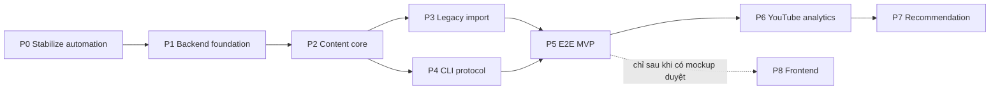

# IMPLEMENTATION_ROADMAP.md

> **Backend-first.** Frontend chỉ implement ở **Phase 8**, sau khi người dùng cung cấp mockup đã duyệt.
> Độ phức tạp: **S** ≤3 ngày · **M** ~1 tuần · **L** ~2–3 tuần · **XL** >3 tuần (1 người).

---

## 0. Bản đồ phase & phụ thuộc



| Phase | Tên | Phức tạp | Phụ thuộc | Song song với |
|---|---|:-:|---|---|
| P0 | Stabilize existing automation | M | — | — |
| P1 | Backend foundation | M | P0 | — |
| P2 | Content core | L | P1 | — |
| P3 | Legacy import | M | P2 | P4 |
| P4 | CLI protocol | L | P2 | P3 |
| **P5** | **End-to-end MVP** | M | P3, P4 | — |
| P6 | YouTube analytics | L | P5 | — |
| P7 | Recommendation | L | P6 | — |
| P8 | Frontend | — | **Mockup người dùng duyệt** | — |

**MVP = P0 → P5.** Đường găng: P0 → P1 → P2 → {P3 ∥ P4} → P5.

---

## Phase 0 — Stabilize existing automation

| | |
|---|---|
| **Goal** | Baseline an toàn; phân loại rõ source / generated / secret trước khi đụng bất cứ thứ gì. |
| **Complexity** | **M** · **Dependencies:** không. **Chặn mọi phase khác.** |

**Scope**
1. ⚠️ **Đưa 47 file automation (9.064 dòng) vào version control** — push lên remote `audio_tool`
   (fork của người dùng), **không** phải `origin` (upstream của người khác).
2. **Phân loại ba nhóm**, ghi thành tài liệu:
   - *Source* (phải commit): `*.py` ở root, `scripts/`, `*.json` config
   - *Generated* (không commit): `output/`, `chunks_cache/`, `drive_input/`, `logs/`
   - *Secret* (tuyệt đối không commit): `.env`, `.github_integration.env`, `.youtube_oauth_clients.env`, `.youtube_channels/`
3. Rà `.gitignore` (hiện đã đúng — xác nhận, không nới lỏng).
4. **Xác định ranh giới Content-Creator**: chỉ đọc, không ghi ngược (`content_repo.py:2-5`).
5. **Chuẩn hoá ID + status**: bảng ánh xạ legacy → mới (đầu vào cho P3).
6. Xác định migration source: `registry.json`, CC package, `analytics_reviews/`, youtube config.

**Out of scope:** refactor code automation; đụng `src/`, `apps/`, `tests/` upstream.

**Files** — Sửa: `.gitignore` (nếu cần). Mới: `docs/content-hub/*`.
**Không đụng:** `src/**`, `apps/**`, `tests/**`, `pyproject.toml [project]`, CI hiện có.
**DB/API/UI** — không có.
**Tests** — script rà secret trước khi push.
**Security** — `git log -p | grep -E 'ghp_|hf_|refresh_token|client_secret'` phải trống.
**Rollback** — chưa có DB; rollback = không push.

**Acceptance**
- [ ] Automation code có mặt trên remote `audio_tool`; `origin` **không** bị push
- [ ] Quét secret trong commit mới: 0 kết quả
- [ ] Bảng phân loại source/generated/secret được duyệt
- [ ] Bảng ánh xạ ID + status legacy hoàn tất

**Risks:** commit nhầm secret (giảm thiểu: rà thủ công + `git-secrets`).

---

## Phase 1 — Backend foundation

| | |
|---|---|
| **Goal** | Skeleton Vercel + Neon chạy được: auth, migration, validation, logging, test harness. |
| **Complexity** | **M** · **Dependencies:** P0 |

**Scope**
1. `apps/hub/` — Next.js App Router, deploy Vercel. Project Node **riêng biệt**, không chia sẻ dependency với thư viện Python.
2. Neon: 3 môi trường (`production` / `preview` / `test`) bằng **Neon branching**.
3. Drizzle + drizzle-kit migration (file SQL có version).
3b. **Hai chế độ driver Neon** theo **ma trận route đầy đủ** ở `TARGET_ARCHITECTURE.md §5.1`: HTTP cho câu lệnh đơn; **Pool/WebSocket cho mọi transaction tương tác** (start, complete, fail, scores, audits, tạo revision, freeze, approve, promote, revoke, reaper, import, analytics ingest). Kèm `pool.end()` trong `finally`, `statement_timeout`, `idle_in_transaction_session_timeout`. **Test tĩnh: route ghi nào chưa khai báo chế độ ⇒ CI fail.**
4. Zod validation layer + error taxonomy RFC 7807.
5. Auth: user (Argon2id + session), PAT, worker token, `CRON_SECRET`.
6. RBAC theo bảng + scope theo channel.
7. `audit_event` append-only.
8. Structured logging + `request_id`; **`/api/internal/health`** (không auth, không chạm DB) **và `/api/internal/readyz`** (**`api_token` scope `ops`**, chạm DB → `db_ok`, `db_branch`, `migration_version`). ⚠️ Hai loại token tách biệt: **`api_token` scope `ops`** — **gắn user**, có ở production, cho vận hành (kiểm được `ADMIN`, audit đúng người) — vs **`INTERNAL_TOKEN`** (secret dùng chung, **chỉ** preview/test, cho `seed`/`reset`/`clock`). Hợp đồng: `API_CONTRACT_PLAN` §12.3–§12.4.
9. Test harness: Vitest + Neon test branch; helper tạo/dọn dữ liệu.
10. **Bootstrap an toàn**: CLI tạo admin đầu tiên, bắt buộc đổi mật khẩu lần đầu, xoay session id sau login, đổi mật khẩu ⇒ revoke session khác, quy trình khôi phục khi mất admin duy nhất.

**Out of scope:** content model, worker, frontend.

**Files** — Mới: `apps/hub/**`, `packages/api-contract/**`; thêm workflow CI **riêng** cho `apps/hub` (không sửa job upstream).
**DB** — `user`, `session`, `api_token`, `role`, `user_channel_role`, `audit_event`, `channel`.
**API** — `/api/v1/auth/*`, `/api/v1/me`, `/api/v1/channels`, `/api/internal/health`.
**UI** — **không có**.

**Tests** — unit auth/hash; integration login; **permission matrix test tự sinh** (endpoint mới thiếu khai báo quyền ⇒ test fail); migration chạy sạch trên DB trống.
**Security** — Argon2id; cookie `HttpOnly`/`Secure`/`SameSite=Strict`; rate-limit login; `CRON_SECRET` so sánh hằng thời gian.
**Observability** — JSON log + `request_id`; đếm lỗi theo `code`.
**Migration** — **forward-only** ở production.
**Rollback** — feature flag; deploy lại binary cũ; schema giữ nguyên.

**Acceptance**
- [ ] Deploy Vercel thành công; `/api/internal/health` trả 200; `/api/internal/readyz` trả `db_ok=true` + đúng `db_branch`
- [ ] Tạo admin bằng CLI; bắt buộc đổi mật khẩu lần đầu
- [ ] User không có quyền kênh X nhận **404** khi gọi tài nguyên kênh X
- [ ] Đổi mật khẩu ⇒ session khác bị revoke
- [ ] Migration chạy sạch trên Neon test branch; harness tạo/dọn được dữ liệu

**Exit:** backend chạy trên Vercel, có auth và migration.

---

## Phase 2 — Content core

| | |
|---|---|
| **Goal** | Nội dung sống trong Neon: item, revision bất biến, source, claim, audit, score có version, approval, freeze. |
| **Complexity** | **L** · **Dependencies:** P1 |

**Scope**
1. `content_item` + `content_revision` (**nội dung text nằm trong DB**: script, SEO, outline…).
2. Freeze + bất biến sau freeze (trigger) + diff hai revision (tính lúc đọc).
3. `source_document` / `source_version` / `claim` / `claim_evidence` + conflict detection.
4. `algorithm` / `algorithm_version` (bất biến sau phát hành).
5. `score_run` **và** `score_dimension` **append-only** (trigger + thu hồi quyền) + verify `input_snapshot_hash` bằng **FK composite** tới `content_revision(id, content_sha256)`.
6. `audit_run` / `audit_finding`.
7. `approval` + revoke + supersede-khi-promote + `approval_policy` theo kênh.
   ⚠️ **Thứ tự bắt buộc: FREEZE trước, APPROVE sau.** Ép bằng FK composite
   `(content_revision_id, required_revision_status='FROZEN')` + `approved_content_sha256`
   + FK composite tới `audit_run`/`score_run` cùng revision & snapshot & gate.
8. `production_manifest` + `frozen_input_manifest`.
9. **`revision_promotion_event`** (append-only) + **`score_run_counter`** (cấp phát `run_sequence`
   nguyên tử). Promote = **một transaction**: kiểm approval `ACTIVE` khớp ID → set
   `production_revision_id` → INSERT promotion event → `SUPERSEDED` approval cũ; lỗi bất kỳ ⇒ rollback.

**Out of scope:** worker, import, analytics.

**DB** — theo `DATA_MODEL_PLAN.md §0.0` (P2).
**API** — `/api/v1/content`, `/content/:id/revisions`, `/scores`, `/audits`, `/approvals`, `/sources`.
**UI** — **không có**.

**Tests**
- Revision `FROZEN` không UPDATE được (I-11)
- `revision_no` tăng đơn điệu khi tạo đồng thời
- Score **append-only**; retry truyền tải idempotent qua `idempotency_record`; chấm lại **có chủ đích** ⇒ `run_sequence` mới (I-S1)
- `input_snapshot_hash` lệch `content_sha256` ⇒ 409 (I-S2)
- `overall_score` tính lại đúng từ dimension × weight (I-S3)
- `algorithm_version` đã phát hành không sửa được (I-S4)
- Soạn nháp revision B **không** đụng approval của A (I-25)
- Promote B ⇒ supersede A trong **cùng transaction** (I-13)
- Agent/worker **không** approve được (I-A1)
- **Không approve được revision `DRAFT`** — CSDL từ chối, không chỉ API (I-A2)
- **Bằng chứng approval phải cùng revision + đúng gate** (I-A3)
- `FROZEN` không bao giờ chuyển `SUPERSEDED`; supersession suy ra từ `production_revision_id` (I-11b)
- Tự-duyệt: test **cả hai** chế độ (I-18)

**Security** — mọi truy vấn lọc theo channel; agent không approve.
**Observability** — đếm revision/score theo thời gian; log mỗi lần freeze/approve.
**Rollback** — forward-only; feature flag theo endpoint.

**Acceptance**
- [ ] Tạo item + revision, freeze, diff hai revision qua API
- [ ] Chấm **đúng tập dimension v1 công bố**; `overall` khớp công thức; `missing_dimensions` được liệt kê; `coverage` thấp ⇒ `overall_score=NULL`; giải thích được delta so lần trước
- [ ] Approve revision; sửa nội dung ⇒ buộc tạo revision mới
- [ ] Không đường nào cho agent tự approve

**Exit:** nội dung + scoring + approval sống trong DB, test được bằng HTTP.

---

## Phase 3 — Legacy import

| | |
|---|---|
| **Goal** | Đưa dữ liệu hiện có vào DB: dry-run, report, idempotency, reconciliation. Hoàn tác bằng **Neon restore**. |
| **Complexity** | **M** · **Dependencies:** P2 · **Song song với P4** |

**Scope** — chi tiết ở `LEGACY_IMPORT_AND_SYNC_PLAN.md`.
1. Adapter đọc `registry.json`, CC package (`manifest.json`), source registry, youtube config *(chỉ tên kênh, **KHÔNG** secret)*.
2. `import_batch` / `import_record` / `legacy_id_map`.
3. `--dry-run` bắt buộc trước `--apply`.
4. Import report + rejected record report.
5. Reconciliation file ↔ DB, báo cáo drift.
6. **Staging + `finalize` một transaction** (`LEGACY_IMPORT_AND_SYNC_PLAN §0`):
   `import_staging_record` unique `(batch, legacy_ref)`; nạp chunk ≤200 commit độc lập;
   `finalize` xử lý **cả đồ thị** theo thứ tự phụ thuộc trong **một** transaction; `APPLY` **insert-only**.
7. **Hoàn tác = Neon branch/PITR restore**, có runbook (`LEGACY_IMPORT_AND_SYNC_PLAN §6`).
   **Không** xây endpoint rollback ở MVP — cơ chế gỡ tầng ứng dụng phức tạp hơn giá trị mang lại
   cho lô insert-only chạy trước khi có dữ liệu vận hành thật.
8. **Insert-only là ràng buộc kiến trúc, không phải tuỳ chọn.** Outcome `UPDATED` **không tồn tại** ở MVP (`LEGACY_IMPORT_AND_SYNC_PLAN §5.2`); trùng ⇒ `SKIPPED_DUPLICATE`. Nhờ vậy nhu cầu hoàn tác rất hẹp, và **Neon restore** là đủ.

**Out of scope:** dual-write (Phase B của `TARGET_ARCHITECTURE.md §7`, sau MVP).

**Tests** — import 2 lần không nhân đôi (I-IMP1); status lạ ⇒ **rejected**, không đoán (fail-closed);
**Neon restore** đưa DB về đúng trạng thái trước `APPLY`; secret ⇒ **huỷ cả lô**; checksum mọi bản ghi.
**Security** — chặn `refresh_token`/`client_secret` lọt vào DB.
**Rollback** — **Neon branch/PITR restore** theo runbook `LEGACY_IMPORT_AND_SYNC_PLAN §6.1` (**không** dùng schema downgrade, **không** có endpoint ứng dụng).

**Acceptance**
- [ ] Dry-run in report đầy đủ mà **không** ghi DB
- [ ] Import ≥1 package CC thật + ≥1 `registry.json` thật
- [ ] Chạy lại import: 0 bản ghi nhân đôi
- [ ] Tạo restore point → `APPLY` → **Neon restore** → DB về đúng trạng thái trước; có `audit_event(IMPORT_RESTORED)`
- [ ] File gốc **không** bị sửa/xoá

**Exit:** dữ liệu cũ có mặt trong DB, truy vết được về nguồn.

---

## Phase 4 — CLI protocol

| | |
|---|---|
| **Goal** | Worker đăng ký, nhận job, báo tiến độ, nộp kết quả — an toàn. |
| **Complexity** | **L** · **Dependencies:** P2 · **Song song với P3** |

**Scope**
1. `worker_machine` / `worker_token` + enrollment code + xoay/thu hồi.
2. `build_job` + claim nguyên tử — **CAS một câu lệnh `UPDATE … RETURNING` trên HTTP driver** (phương án B, xem `API_AND_WORKER_PROTOCOL.md §4.1.1`) + `job_attempt` + lease + heartbeat + **reaper hai tầng** (reap cơ hội ở claim + cron thưa).
3. Ba bộ đếm + trạng thái `DEFERRED`.
4. Progress / log theo lô + **redaction hai lớp**.
5. Artifact **metadata-only** + checksum + promotion.
6. Python CLI client (`hub_cli/`) + handler đăng ký theo `job_type`.
7. ⚠️ **Trích handler hẹp** — **không** bọc `long_batch_runner.py`/`short_batch_runner.py` nguyên trạng:
   `run_audio_stage(topic)` xử lý **mọi tập sẵn sàng của topic** (`long_batch_runner.py:155-160`);
   `run_step(cmd)` nhận argv tuỳ ý (`:195-199`). Handler phải xử lý **đúng một revision**,
   ghi **chỉ trong workspace riêng**, poll cancel, trả kết quả có kiểu.

**Tests**
- Race: N **tiến trình độc lập** claim đồng thời ⇒ mỗi job đúng một worker (I-3). **Bắt buộc chạy trên Neon branch thật, qua đúng HTTP driver production** — không mock, không SQLite, không N-promise-trong-một-process.
- Lease hết hạn ⇒ worker cũ bị 409 (I-14)
- `complete` idempotent (I-15)
- Quota deferral **không** đốt `execution_attempt` (I-24)
- Job trùng khi `DEFERRED` bị chặn (I-12)
- Chỉ artifact `PROMOTED` mới publish được (I-23)
- Redaction: bơm token vào log ⇒ không xuất hiện trong `job_event` (I-8)
- `params` field lạ ⇒ Zod `.strict()` từ chối (I-7)
- Test AST: **không** `shell=True` trong `hub_cli/` (I-19)
- **7 bài characterization/isolation** cho mỗi stage trước khi bọc (`TEST_STRATEGY.md §5b`)

**Observability** — độ sâu hàng đợi, tuổi job, tỉ lệ lease expiry/retry, thời lượng theo `job_type`.
**Rollback** — cờ `USE_HUB_QUEUE` theo từng `job_type`; pipeline CLI cũ chạy song song.

**Acceptance**
- [ ] Worker đăng ký, claim, start, heartbeat, complete một job thật
- [ ] Giết worker giữa chừng ⇒ job được nhận lại và hoàn tất
- [ ] Test race: 0 job bị xử lý hai lần
- [ ] Không có secret trong `job_event`

**Exit:** hàng đợi job an toàn, quan sát được.

---

## Phase 5 — End-to-end MVP ⭐

| | |
|---|---|
| **Goal** | **Một** nội dung đi trọn vòng qua backend thật. Mốc chứng minh kiến trúc. |
| **Complexity** | **M** · **Dependencies:** P3, P4 |

**Lát cắt dọc bắt buộc:**
```
Import 1 content package có sẵn
→ lưu content + revision trong Neon
→ lưu source + metadata liên quan
→ CLI chạy audit → gửi audit result
→ lưu score nhiều dimension (kèm algorithm_version)
→ CLI tạo revision cải thiện (DRAFT)
→ user **freeze** revision (chốt hash) → user **approve** revision đã FROZEN
→ tạo build job
→ CLI claim job
→ CLI build 1 artifact (audio)
→ CLI gửi artifact metadata + checksum (FILE Ở LẠI LOCAL)
→ backend verify + promote artifact
→ content chuyển PRODUCTION_READY
```

**Tối thiểu:** 1 channel · 1 content item · 1 revision · 1 source package · 1 audit run ·
1 score run · 1 approval · 1 worker · 1 build job · 1 artifact · **1 test E2E API đầy đủ**.

**Chưa cần:** frontend, calendar UI, auto-publish, recommendation AI phức tạp, multi-agent
orchestration, migrate đủ 97 package, dashboard analytics, realtime UI, web video/audio editor.

**Tests** — **một test E2E chạy toàn bộ chuỗi bằng HTTP client**, không cần trình duyệt.
Đây là tiêu chí nghiệm thu quan trọng nhất của MVP.

**Acceptance**
- [ ] Test E2E xanh, lặp lại được (idempotent, tự dọn)
- [ ] Artifact có checksum verify và `promotion_state='PROMOTED'`
- [ ] Media **không** rời máy local; DB chỉ có `local_path` + `sha256`
- [ ] Toàn chuỗi có `audit_event` truy vết được
- [ ] **Không cần bất kỳ UI nào** để chạy test

**Exit:** ✅ **MVP hoàn tất.** Kiến trúc được chứng minh đầu-cuối.

---

## Phase 6 — YouTube analytics

| | |
|---|---|
| **Goal** | Đồng bộ analytics đa kênh, **giữ lịch sử**, không mất dữ liệu hiệu chỉnh. |
| **Complexity** | **L** · **Dependencies:** P5 |

**Scope**
1. Channel sync + video sync (`youtube_catalog.py`), phân loại Long/Short.
2. ⚠️ **Viết hàm query analytics MỚI**: `get_video_analytics()` hiện **không truyền `dimensions`**
   (`youtube_analytics.py:54-60`) ⇒ trả **tổng gộp cả khoảng**. Lưu thẳng vào bảng theo ngày sẽ
   **bịa ngày** và hỏng lịch sử vĩnh viễn. Cần `dimensions=day`; map theo `columnHeaders`, không theo vị trí cột.
3. ⚠️ **Viết phân loại lỗi MỚI**: `_query()` gộp **mọi** `HTTPError` thành một exception (`:37-38`)
   — **không có** xử lý quota. Xử lý quota chỉ có ở `youtube_upload.py:111-115` và **không dùng lại được**.
4. Snapshot lịch sử: UPSERT + `_history` (SCD-2).
5. `analytics_sync_partition` + checkpoint + `is_complete`.
6. Vercel Cron → **chỉ enqueue** `SYNC_ANALYTICS` (token YouTube ở local; Vercel không gọi được).
7. `publish_record` (chuẩn bị gói publish; **chưa** auto-publish).

**Tests** — fixture từ `analytics_reviews/**_raw.json` (dữ liệu thật có sẵn); ingest lại ngày cũ sau
hiệu chỉnh ⇒ **cả** số mới **và** số cũ truy vấn được (I-5); map theo `columnHeaders` (I-26);
ingest dở dang ⇒ `is_complete=false` (I-27); backfill chồng lấn không nhân đôi; phân loại lỗi quota.

**Acceptance**
- [ ] Sync 3 kênh thật, khớp YouTube Studio (sai số ≤1%)
- [ ] Sync lại ngày đã hiệu chỉnh ⇒ giữ được cả hai giá trị
- [ ] `quota_units_estimated` được ghi mỗi lần sync

---

## Phase 7 — Recommendation & continuous improvement

| | |
|---|---|
| **Goal** | Đề xuất nội dung có giải thích; so dự báo với thực tế để hiệu chỉnh trọng số. |
| **Complexity** | **L** · **Dependencies:** P6 |

**Scope** — scoring có version (từ P2) áp lên dữ liệu analytics; `recommendation_run` /
`recommendation_item`; `predicted_metrics` vs `actual_metrics` tại mốc D1/D7/D28; phát hiện trùng
nội dung; content gap theo pillar.

**Out of scope:** embeddings, ML model, bandit — chỉ cân nhắc sau ≥6 tháng dữ liệu.

**Tests** — điểm tái lập được; `breakdown` cộng đúng `total`; thiếu dữ liệu ⇒ báo `missing_data`
chứ **không** đoán; so điểm giữa hai `algorithm_version` khác nhau bị **từ chối** (phải chấm lại cùng version).

---

## Phase 8 — Frontend implementation

| | |
|---|---|
| **Goal** | Implement UI đúng theo mockup người dùng cung cấp. |
| **Dependencies** | ⚠️ **Mockup do người dùng thiết kế và duyệt.** |

**Quy tắc:**
- **Không bắt đầu** trước khi có mockup được duyệt.
- **Không tự thiết kế UI** — implement đúng mockup + đúng contract ở `API_CONTRACT_PLAN.md`.
- Backend **không** sửa để chiều UI nếu điều đó phá vỡ contract; contract thiếu thì cập nhật contract trước, có review.

---

## Chiến lược rollback chung (**forward-only**)

1. **Migration production là forward-only.** Không chạy `downgrade` trên DB thật — nó phá huỷ chính
   audit/approval/revision/score/analytics mà hệ thống sinh ra để bảo toàn.
2. Thay đổi schema **tương thích ngược một phiên bản** (thêm cột nullable → backfill → mới bắt buộc)
   ⇒ rollback = **deploy lại binary cũ**, schema giữ nguyên.
3. **Neon branching** cho backup/PITR; diễn tập restore định kỳ.
4. `downgrade` chỉ viết và test cho **DB dev dùng một lần**.
5. Mỗi phase sau một feature flag. Pipeline CLI hiện tại **không bị gỡ** cho tới khi P5 chạy ổn định
   ≥2 tuần. Backend chạy *song song*, không *thay thế đột ngột*.
