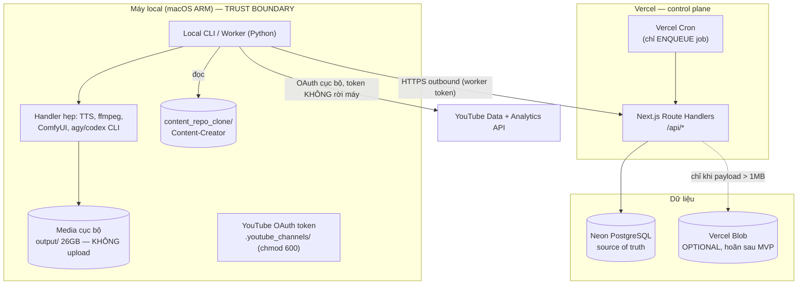
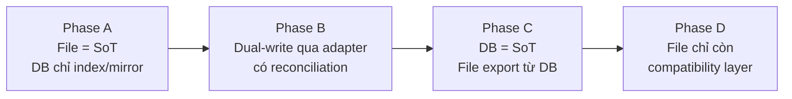

# TARGET_ARCHITECTURE.md

> **Phạm vi: BACKEND-FIRST.** Giai đoạn này chỉ thiết kế backend, database, API, worker protocol,
> storage, auth và test. **Không** thiết kế UI. Frontend chỉ được định nghĩa ở mức *API contract*
> (xem `API_CONTRACT_PLAN.md`) và sẽ implement ở Phase 8 sau khi người dùng duyệt mockup.
>
> Đọc `REPOSITORY_ASSESSMENT.md` trước.

---

## 0. Nguyên tắc dẫn đường

1. **Vercel là control plane, không phải compute plane.** Mọi tác vụ nặng (TTS, ffmpeg, render,
   AI CLI, truy cập filesystem) chạy trên **Local CLI**. Vercel chỉ quản lý trạng thái, quyết định và audit.
2. **Neon là source of truth cho dữ liệu có cấu trúc và nội dung text.** Không để nội dung chỉ
   tồn tại trong file local.
3. **Media không rời máy local.** *(Quyết định của người dùng, 2026-07-29)* — chỉ **nội dung dạng text**
   (audio script, SEO, outline, prompt…) được lưu lên backend. `.mp4`/`.wav` ở lại đĩa; DB chỉ giữ
   metadata + đường dẫn + checksum. Xem `STORAGE_STRATEGY.md`.
4. **Server không bao giờ gửi shell command.** Job mang `job_type` thuộc allowlist đóng; worker tự
   ánh xạ sang implementation đã cài sẵn.
5. **Không thay thế pipeline hiện có.** Backend *import → index → đồng bộ → dần trở thành source of truth*
   theo 4 giai đoạn A→B→C→D (§7).
6. **Không có bước nào phụ thuộc frontend để kiểm thử.** Mọi luồng phải test được bằng HTTP client.

---

## 1. System context



**Không mở inbound port trên máy local.** Mọi kết nối do CLI khởi tạo ra ngoài.

---

## 2. Trách nhiệm từng thành phần

| Thành phần | Sở hữu | **KHÔNG** làm |
|---|---|---|
| **Vercel API** | Auth, channel, content item, revision, calendar metadata, source, claim, audit, score, approval, build job, artifact **metadata**, analytics snapshot, audit trail, phục vụ dữ liệu cho frontend tương lai | ffmpeg, TTS, render video, gọi Codex/Claude/Cursor CLI, đọc filesystem local, tác vụ chạy lâu |
| **Neon Postgres** | Toàn bộ dữ liệu có cấu trúc **+ nội dung text** (script, SEO, outline, prompt, claim, score) | Lưu media nhị phân |
| **Vercel Blob** | *(Hoãn — xem §4)* Chỉ dùng khi payload text vượt ngưỡng, hoặc gói evidence/log nén | Media video/audio; dữ liệu cần query/filter |
| **Local CLI** | Claim job, chạy TTS/ffmpeg/AI CLI, sinh media, chấm điểm, đề xuất revision, gọi YouTube API, đẩy kết quả lên API | Tự approve nội dung do chính nó tạo; tự publish khi chưa duyệt |
| **Content-Creator repo** | Nguồn biên tập gốc (research/script/QA) | Bị ghi ngược từ Hub (chỉ đọc) |

---

## 3. Ràng buộc Vercel (đã xác minh từ tài liệu chính thức)

| Ràng buộc | Giá trị | Hệ quả thiết kế |
|---|---|---|
| **Request/response body** | **4,5 MB** (413 `FUNCTION_PAYLOAD_TOO_LARGE`) | Payload text lớn nhất đo được là **194,8 KB** (SEO/shot-list) và **67,8 KB** (audio script) ⇒ **dư 23–66×**. An toàn. Media 337 MB **không thể** đi qua API — và cũng **không cần**, vì media ở lại local. |
| **Max duration** | Hobby 300s; Pro 800s (1800s beta) | Không chạy render/TTS trên Vercel. Endpoint phải trả nhanh; việc dài giao cho job. |
| **Memory** | Hobby 2 GB / Pro 4 GB | Không xử lý file lớn trong function. |
| **Bundle** | 250 MB (Node) | Tránh dependency nặng. |
| **Cron** | Vercel Cron gọi HTTP endpoint | Cron **chỉ enqueue job**, không tự gọi YouTube (token nằm ở local). |

> Nguồn: `vercel.com/docs/functions/limitations` (cập nhật 2026-07-01).

**Tại sao ràng buộc 4,5 MB không còn là vấn đề:** vì quyết định "chỉ lưu content text" (§0.3),
mọi payload đi qua API đều là text nhỏ. Đây là lý do chính khiến kiến trúc này khả thi trên Vercel.

---

## 4. Storage: Neon vs Blob vs Local

Tóm tắt (chi tiết ở `STORAGE_STRATEGY.md`):

| Loại dữ liệu | Nơi lưu | Lý do |
|---|---|---|
| Content text: hook, outline, **audio script**, SEO, title/description/keyword/hashtag, chapters, semantic beats, visual prompt, research summary, risk note | **Neon** (`TEXT` / `JSONB`) | ≤ 67,8 KB/script, ≤ 194,8 KB/JSON — nhỏ, cần query/diff/version |
| Structured: channel, content item, revision, source, claim, audit, score, approval, job, analytics | **Neon** | Cần join, filter, aggregate |
| Media: `.mp4` (avg 337 MB), `.wav`, `.ass`, `.srt` | **Local filesystem** | 25,3 GB; không upload. DB lưu `local_path` + `sha256` + `size` |
| Log build, evidence bundle lớn, research snapshot thô | **Blob (hoãn)** hoặc local | Chỉ dùng khi > ngưỡng; **không** thuộc MVP |

**Quyết định MVP: KHÔNG dùng Vercel Blob.** Lý do:
- Nội dung text vừa khít Postgres và cần query/diff/version — Blob sẽ làm mất khả năng đó.
- Media không upload nên không có nhu cầu object storage.
- Bớt một dịch vụ ⇒ bớt secret, bớt chi phí, bớt bề mặt tấn công.

Blob được **thiết kế sẵn nhưng chưa bật**: bảng `artifact` đã có cột `storage_backend`
(`LOCAL | BLOB`) + `blob_url` nullable, nên bật sau không cần migration phá vỡ.

---

## 5. Backend stack (đề xuất, kèm lý do)

| Lớp | Chọn | Lý do dựa trên repo + Vercel |
|---|---|---|
| Runtime/API | **Next.js App Router — Route Handlers** (`app/api/**/route.ts`) | Là đường đi được hỗ trợ tốt nhất trên Vercel; cùng project phục vụ frontend Phase 8 mà không phải đổi hosting. |
| Ngôn ngữ | **TypeScript** | Bắt buộc để type-safe với Drizzle + Zod. Repo chưa có TS ⇒ không có nợ kế thừa. |
| ORM | **Drizzle ORM + drizzle-kit** | Không có engine binary (Prisma có) ⇒ bundle nhỏ, cold start tốt hơn trên serverless. SQL-first ⇒ viết trực tiếp được câu **CAS `UPDATE … RETURNING`** của job claim mà vẫn giữ type-safety. Migration là file SQL đọc/review được. |
| Driver | **`@neondatabase/serverless` — dùng CẢ HAI chế độ theo workload** (§5.1) | Không có "một driver cho tất cả". HTTP cho thao tác **một câu lệnh**; Pool/WebSocket cho **transaction tương tác nhiều câu lệnh** có khoá + rẽ nhánh phía app. |
| Validation | **Zod** | Schema dùng chung cho input validation + sinh OpenAPI + type. `strict()` để từ chối field lạ (chống job payload injection). |
| Auth | **Tự dựng tối thiểu**: Argon2id + token đục (opaque) lưu hash | Không có frontend ⇒ không cần OAuth/social. Auth.js là thừa và thêm lock-in. Xem §6. |
| Blob SDK | **`@vercel/blob`** — *chỉ khi bật Blob* | Hoãn. |
| Scheduling | **Vercel Cron** → enqueue job | Không thể tự gọi YouTube (token ở local). |
| CLI client | **Python `httpx`** + client sinh từ OpenAPI | CLI hiện tại là Python; giữ nguyên ngôn ngữ. |
| Test | **Vitest** + Neon branch riêng cho test | Xem `TEST_STRATEGY.md`. |

### 5.1 Chính sách driver theo workload *(bắt buộc — Codex v2R8 HIGH)*

> ⚠️ **Sửa theo Codex v2R8.** Bản trước chốt "HTTP driver" cho **toàn bộ** backend, dựa trên việc
> job claim là *một câu lệnh*. Nhưng kế hoạch **đã** có sẵn hai luồng **transaction tương tác nhiều
> câu lệnh**: promote (`API_CONTRACT_PLAN §6.4`) và ghi score (`DATA_MODEL_PLAN §5`). Cả hai đều
> đọc → **rẽ nhánh trong code app** → ghi tiếp **trong khi vẫn giữ `FOR UPDATE`**.
> Neon HTTP chỉ hỗ trợ one-shot / transaction **phi tương tác**; nếu tách thành nhiều lời gọi HTTP
> thì **khoá được nhả sau mỗi lời gọi** ⇒ mở lại đúng những race mà giao thức sinh ra để đóng.

**Ma trận đầy đủ — mọi route có ghi đều phải nằm trong bảng này.** Route mới **không** được merge
nếu chưa khai báo chế độ (kiểm bằng test tĩnh).

| Route / workload | Chế độ | Lý do |
|---|---|---|
| `GET` bất kỳ (list, get, diff, analytics read) | **HTTP** | Không ghi |
| `POST /worker/jobs/claim` | **HTTP** | Một câu `UPDATE … RETURNING` (CAS) |
| `POST /worker/jobs/{id}/heartbeat` | **HTTP** | Một câu `UPDATE … WHERE lease_token=… RETURNING` |
| `POST /worker/jobs/{id}/logs` | **HTTP** | `INSERT … ON CONFLICT DO NOTHING` theo `seq` |
| **`POST /worker/jobs/{id}/start`** | **Pool** | Verify lease → tăng `execution_attempt` → tạo `job_attempt`; idempotent khi đã có attempt mở |
| **`POST /worker/jobs/{id}/complete`** | **Pool** | Idempotency + đóng attempt + `DONE` + **promote artifact** (`PROVISIONAL→PROMOTED`, cũ→`SUPERSEDED`) |
| **`POST /worker/jobs/{id}/fail`** | **Pool** | Đóng attempt + phân loại lỗi + `QUEUED`/`DEFERRED`/`FAILED` + đặt `not_before` |
| `POST /worker/jobs/{id}/artifacts` | **HTTP** | `INSERT … ON CONFLICT DO NOTHING`, luôn `PROVISIONAL` |
| **`POST /worker/jobs/{id}/scores`**, **`/audits`** | **Pool** | Idempotency → cấp `run_sequence` → run + dimensions → response |
| **`POST /worker/revisions`** (agent tạo bản cải thiện) | **Pool** | Cấp `revision_no` nguyên tử — xem ghi chú dưới |
| **`POST /v1/revisions`** (user tạo) | **Pool** | Như trên |
| **`POST /v1/revisions/{id}/freeze`** | **Pool** | Kiểm trong khoá → tính `content_sha256` → set `FROZEN` |
| **`POST /v1/revisions/{id}/approve`** | **Pool** | Kiểm gate/policy/self-approval trong khoá rồi ghi |
| **`POST /v1/revisions/{id}/promote`** | **Pool** | Khoá item + 2 approval, rẽ nhánh 2b/4′/7′, CAS, ghi event |
| `POST /v1/approvals/{id}/revoke` | **Pool** | Khoá hàng rồi đổi trạng thái có điều kiện |
| `POST /v1/jobs` (tạo job) | **HTTP** | Một `INSERT` + partial unique chặn trùng |
| `POST /v1/jobs/{id}/cancel` | **HTTP** | Một `UPDATE … SET cancel_requested=true` |
| **Reaper** (`/cron/reap-leases` **và** reap cơ hội trong `claim`) | **Pool** *(hoặc HTTP nếu gộp trọn vào 1 CTE)* | Đóng attempt → so `execution_attempt` → đổi trạng thái. Nếu viết được thành **một** `WITH … UPDATE` thì dùng HTTP |
| **Import: nạp chunk vào staging** | **HTTP** | `INSERT` theo lô vào bảng staging |
| **Import: `finalize` (dry-run / apply)** | **Pool** | Một transaction mô phỏng hoặc áp dụng theo thứ tự phụ thuộc. *(Không có rollback ứng dụng — dùng Neon restore)* |
| `POST /v1/workers/enrollment-codes`, register, rotate, revoke | **Pool** | Đọc-kiểm-ghi trên hàng token |
| Analytics ingest snapshot | **Pool** | UPSERT + đẩy bản cũ sang `_history` + cập nhật partition |
| `POST /v1/auth/login` | **Pool** | Verify mật khẩu → **xoay session id** → revoke session cũ nếu cần |
| `POST /v1/auth/logout`, đổi mật khẩu | **Pool** | Revoke nhiều session |
| `PUT /worker/capabilities` | **HTTP** | Một `UPDATE` |
| `POST /worker/shutdown` | **HTTP** | Một `UPDATE … WHERE leased_by=… ` trả lease. Miễn trừ khỏi `READ_ONLY_MODE`? **Không cần** — drain xong trước khi bật read-only (`LEGACY_IMPORT §6.1`) |
| `GET /api/internal/readyz` | **HTTP** | Chạm DB để báo `db_ok` + `db_branch`; dùng xác nhận restore |
| **`POST /api/internal/drain-reap`** | **Pool** | Thu hồi lease quá hạn + đóng attempt + chuyển job. **Có batch limit** (`max_rows`/`max_ms`), gọi lặp khi `has_more`; idempotent. Cần vì reaper cơ hội nằm ở `claim` mà `DRAINING` đang chặn |
| `POST /worker/jobs/{id}/cancelled` | **HTTP** | Một `UPDATE` có điều kiện lease |
| `POST /worker/register` | **Pool** | Tiêu huỷ enrollment code + tạo machine + phát token |
| `POST /worker/token/rotate` | **Pool** | Phát token mới + đặt grace cho token cũ |
| `POST /cron/enqueue-analytics` | **HTTP** | `INSERT` job (idempotent theo ngày/kênh) |
| `POST /v1/import/batches` | **HTTP** | Một `INSERT` |
| `POST /v1/import/batches/:id/records` | **HTTP** | `INSERT … ON CONFLICT` vào staging |
| **`POST /v1/import/batches/:id/finalize`** | **Pool** | Một transaction mô phỏng/áp dụng cả đồ thị |
| *(hoàn tác import)* | — | **Không có endpoint.** Dùng Neon branch/PITR restore (`LEGACY_IMPORT_AND_SYNC_PLAN §6`) |
| `POST /v1/recommendations/runs` (+ promote đề xuất) | **Pool** | Ghi run + items nguyên tử |

> **`revision_no` phải cấp nguyên tử.** `MAX(revision_no)+1` đọc ngoài khoá sẽ đụng khi hai agent
> cùng tạo revision. Dùng **cùng mẫu** với `score_run_counter`: bảng đếm theo `content_item_id` với
> `INSERT … ON CONFLICT DO UPDATE … RETURNING`, hoặc `SELECT … FOR UPDATE` trên `content_item`.
> Có test đồng thời (I-REV1).

**Quy tắc kỹ thuật bắt buộc khi dùng Pool trên Vercel:**
1. Pool **theo phạm vi request**, `await pool.end()` trong `finally` — không để rò kết nối khi
   function bị đóng băng.
2. Đặt `statement_timeout` và `idle_in_transaction_session_timeout` để một invocation chết không
   giữ khoá mãi.
3. Transaction phải **ngắn** (mọi việc nặng đã ở CLI).
4. Giới hạn số kết nối đồng thời cho khớp hạn mức Neon.

**Phương án thay thế (nếu muốn giữ HTTP thuần):** đưa **toàn bộ** logic promote/score vào một
**hàm PL/pgSQL** làm hết validate + khoá + rẽ nhánh + ghi + trả mã lỗi có kiểu, rồi gọi bằng
**một** câu `SELECT promote_revision(...)`. Đánh đổi: logic nghiệp vụ nằm trong DB, khó test và
review hơn. **Khuyến nghị: dùng Pool cho các luồng tương tác** — đây là **quyết định D1b** cần duyệt.

> **Kiểm thử:** I-PROMO3/4/6/8/9 và I-S5 phải chạy qua **đúng route + đúng driver của production**,
> **không** dùng kết nối test đặc quyền.
>
> **Nguồn chuẩn của ma trận:** sinh từ **inventory OpenAPI** (`packages/api-contract`). `I-DRV1`
> đối chiếu **mọi method khác `GET`** trong OpenAPI với bảng khai báo máy đọc được; route thiếu khai
> báo ⇒ **CI fail**. Miễn trừ chỉ được chấp nhận cho POST **chứng minh được là chỉ đọc**, và phải
> ghi rõ lý do trong file khai báo.

### Vì sao Drizzle chứ không Prisma
1. Prisma Client kèm query engine (binary) ⇒ bundle lớn, cold start chậm hơn trên Lambda.
2. **SQL trong suốt**: câu CAS của job claim, các **FK composite** (snapshot/approval/job-frozen) và
   partial unique index đều viết thẳng được, giữ type-safety đúng chỗ cần.
3. Migration là file SQL đọc được, review được — hợp yêu cầu "migration có version".

> ⚠️ Hàng đợi hiện tại **không** cần `FOR UPDATE SKIP LOCKED`; claim là **một câu lệnh CAS**
> (`API_AND_WORKER_PROTOCOL.md §4.1.1`, phương án B). `SKIP LOCKED` + Pool/WebSocket chỉ xuất hiện
> trong **đường xét lại sang phương án A** nếu đo được tranh chấp hàng đầu.
>
> Nếu người dùng ưu tiên Prisma, vẫn khả thi nhưng phải chấp nhận raw SQL cho các ràng buộc
> composite và bundle lớn hơn. Đây là **quyết định D1** cần duyệt.

### Cấu trúc thư mục đề xuất
```
apps/hub/                 # Next.js project — deploy lên Vercel
  app/api/…/route.ts      # route handlers theo domain
  src/db/schema/*.ts      # Drizzle schema
  src/db/migrations/*.sql # drizzle-kit
  src/lib/{auth,errors,pagination,audit}.ts
  src/domain/*            # logic nghiệp vụ (thuần, test được, không phụ thuộc HTTP)
  tests/
packages/api-contract/    # Zod schema + type dùng chung, sinh OpenAPI
hub_cli/                  # Python CLI client + worker handlers
```
> ⚠️ **Không** đụng `src/vieneu/**`, `apps/gradio_main.py`, `apps/web_stream.py`, `tests/`,
> `pyproject.toml [project].dependencies`, hay CI hiện có. `apps/hub/` là project Node riêng biệt,
> không chia sẻ dependency với thư viện Python.

---

## 6. Authentication & authorization

Ba loại principal, **tách biệt hoàn toàn**:

| Principal | Cơ chế | Dùng cho |
|---|---|---|
| **User** | Email + Argon2id → session token đục (hash `sha256` trong DB), cookie `HttpOnly`/`Secure`/`SameSite=Strict` | Frontend tương lai; thao tác thủ công |
| **Worker** | `worker_token` riêng, Bearer, hash trong DB, TTL + xoay có overlap, revoke tức thì | Local CLI |
| **Cron** | `CRON_SECRET` header do Vercel gửi, so sánh hằng thời gian | Chỉ endpoint enqueue |

**Phân quyền:** RBAC theo bảng, **scope theo channel** (`user_channel_role`).
Worker **không** phải user — không dùng bảng role của user; quyền của worker là
`capabilities` + phạm vi job, ràng ở server.

**Bất biến bảo mật:**
- Worker token chỉ truy cập `/api/worker/*`.
- Cross-channel: truy vấn luôn lọc theo quyền; trả **404** (không phải 403) để không lộ tồn tại.
- ⚠️ Worker token là bearer **liên kết** với máy, **không chứng minh sở hữu**. Ai lấy được token đều
  mạo danh được. Bù bằng: TTL ngắn, revoke nhanh, cảnh báo khi dùng đồng thời từ hai nguồn.
  mTLS/DPoP là bước sau MVP.
- **Algorithm không được tự approve nội dung do chính nó tạo** — `approval` chỉ chấp nhận
  `actor_kind='USER'`; revision do agent tạo luôn vào `DRAFT`/`REVIEW_REQUIRED`.

---

## 7. Chiến lược chuyển source of truth (A → B → C → D)



| Giai đoạn | Ghi ở đâu | Đọc ưu tiên | Điều kiện để sang bước sau |
|---|---|---|---|
| **A** | File (pipeline hiện tại) | File | Import chạy sạch, reconciliation 0 khác biệt trong 7 ngày |
| **B** | Cả hai qua **một adapter duy nhất** | DB, fallback file | Không có drift trong 14 ngày; rollback đã diễn tập |
| **C** | DB | DB | Pipeline local đọc được bản export từ DB |
| **D** | DB | DB | — |

**MVP dừng ở Phase A** (một chiều: file → DB). Dual-write chỉ bắt đầu sau khi có reconciliation
report ổn định. **Cấm** nhảy thẳng sang DB-only.

Chi tiết ở `LEGACY_IMPORT_AND_SYNC_PLAN.md`.

---

## 8. Vòng đời (tóm tắt)

### 8.1 Content — hai tầng, không gộp
- **Tầng biên tập** (Content-Creator sở hữu): `DRAFTING → READY_FOR_CONTENT_REVIEW → CONTENT_REVISION_REQUIRED → CONTENT_APPROVED → READY_FOR_TTS_HANDOFF → CONTENT_PACKAGE_COMPLETE | BLOCKED`
- **Tầng sản xuất** (Hub sở hữu): `PLANNED → FROZEN → BUILDING → BUILT → PUBLISH_READY → SCHEDULED → PUBLISHED → ANALYZING`, cùng `BUILD_FAILED`, `NEEDS_REVISION`, `ARCHIVED`

Điểm nối: chỉ nhận package khi `content_status = READY_FOR_TTS_HANDOFF` **và**
`qa_status ∈ {PASS, PASS_WITH_ADVISORIES}` — đúng logic `content_repo.py:33-34`. Fail-closed.

### 8.2 Revision
`DRAFT → REVIEW_REQUIRED → FROZEN` — **kết thúc ở đây, không có `SUPERSEDED`.**
- `FROZEN` **bất biến tuyệt đối**; sửa = tạo revision mới. Trigger chặn **mọi** UPDATE.
- **Supersession là dữ liệu suy ra**, không phải trạng thái: đọc `content_item.production_revision_id`
  + bảng append-only `revision_promotion_event`. (Nếu để `FROZEN → SUPERSEDED` thì chính trigger bất
  biến sẽ chặn, hoặc phải nới trigger và mất tính bất biến — xem `DATA_MODEL_PLAN.md §3`.)
- **Thứ tự bắt buộc:** `DRAFT → sửa → FREEZE (chốt hash) → APPROVE → tạo job`. Không approve được revision `DRAFT`.
- Approval gắn **revision**, không gắn item.
- Approval của A giữ `ACTIVE` chừng nào A còn là `production_revision_id`; chỉ `SUPERSEDED`
  **trong cùng transaction** promote B đã approve.
- Chặn "approve A build B" bằng **so khớp ID**, không bằng supersession.

### 8.3 Job
`QUEUED → LEASED → RUNNING → DONE | FAILED | CANCELLED`, cùng `DEFERRED` (hoãn do quota).
Ba bộ đếm tách biệt: `claim_count`, `execution_attempt`, `quota_deferral_count`.

### 8.4 Analytics
Cron (Vercel) → enqueue `SYNC_ANALYTICS` → CLI claim → gọi YouTube (token local) → normalize →
POST snapshot → Neon lưu **UPSERT + bảng `_history`** (SCD-2) để không mất lịch sử hiệu chỉnh.

### 8.5 Score
Mỗi lần chấm tạo **bản ghi mới** kèm `algorithm_id` + `algorithm_version` + `input_snapshot_hash`.
**Không bao giờ ghi đè.** Chi tiết ở `ALGORITHM_VERSIONING_PLAN.md`.

---

## 9. Job type allowlist (đóng)

```
ANALYZE_CONTENT · SCORE_CONTENT · IMPROVE_CONTENT
BUILD_AUDIO · BUILD_VIDEO · BUILD_SUBTITLE · BUILD_THUMBNAIL
SYNC_ANALYTICS · EXPORT_PACKAGE
```
Server lưu `job_type` + `params` (đã validate bằng Zod `strict()`).
Worker có bảng ánh xạ `job_type → hàm Python đã đăng ký`.
**Không có trường nào chứa lệnh, đường dẫn nhị phân, hay tham số CLI thô.**

---

## 10. Xử lý lỗi & error taxonomy

| Lớp | Mã | Hành vi |
|---|---|---|
| Validation | `VALIDATION_FAILED` (422) | Trả chi tiết field |
| Auth | `UNAUTHENTICATED` (401) / `FORBIDDEN` (403) / `NOT_FOUND` (404 cho cross-channel) | — |
| Xung đột | `LEASE_EXPIRED`, `REVISION_FROZEN`, `DUPLICATE_JOB`, `APPROVAL_REVOKED` (409) | Không retry mù |
| Quota ngoài | `YOUTUBE_DAILY_QUOTA_EXCEEDED` → job `DEFERRED`; `YOUTUBE_RATE_LIMITED` → backoff | Tách bạch, không gộp |
| Hạ tầng | `DB_UNAVAILABLE` (503), `FUNCTION_TIMEOUT` (504) | Retry có jitter |

Mọi response lỗi theo RFC 7807 + `request_id`.

---

## 11. Mô hình bảo mật (tóm tắt; chi tiết ở `RISK_REGISTER.md`)

| Kiểm soát | Thiết kế |
|---|---|
| Chống RCE | `job_type` enum đóng; Zod `strict()`; worker tự map sang hàm; **cấm `shell=True`** (repo hiện đã sạch — giữ bằng test AST) |
| Prompt injection từ nguồn | Nội dung nguồn/LLM là **dữ liệu không tin cậy**: không đưa vào đường dẫn file, tên file, hay tham số subprocess; đánh dấu `is_untrusted` khi nạp vào prompt |
| CLI gửi dữ liệu giả | Mọi ghi kèm `lease_token` + `job_attempt_id`; score gắn `input_snapshot_hash` server verify được |
| Secret | YouTube `client_secret`/`refresh_token` **không bao giờ** rời máy local, **không** vào DB, **không** vào Blob |
| Log redaction | Hai lớp (worker trước khi gửi, server trước khi ghi) |
| Replay | `Idempotency-Key` + partial unique index |
| Upload | *(khi bật Blob)* giới hạn kích thước, allowlist content-type, checksum bắt buộc |

---

## 12. Điều KHÔNG làm ở giai đoạn này

**Frontend:** không UI component, không styling, không dashboard/calendar UI, không visual design.
Chỉ định nghĩa API contract + shape dữ liệu (`API_CONTRACT_PLAN.md`).

**Kỹ thuật:** không multi-tenant thật, không embeddings/vector DB, không dự đoán CTR/retention,
không bandit, không WebSocket/realtime, không microservice, không auto-publish, không migrate
đủ 97 package, không dashboard analytics đầy đủ, không Blob ở MVP.
